# string的基本操作1


> * [string](https://legacy.cplusplus.com/reference/string/string/)
> * string比STL出现的还要早
> * 是管理字符的数组的数据结构


## string类对象的常见构造

> [construct字符串常见的构造函数](https://legacy.cplusplus.com/reference/string/string/string/)

| 函数名称         | 函数原型                                                   | 功能                                                         |
| ---------------- | ---------------------------------------------------------- | ------------------------------------------------------------ |
| default 默认构造 | string()                                                   | 创建一个空字符串，字符串长度为0，不含任何字符。              |
| C风格字符串构造  | string (const char* s);                                    | 复制字符指针s指向的、以'\0'空字符结尾的标准C字符串序列。     |
| copy 拷贝构造    | string (const string& str);                                | 根据传入的str字符串，生成一份完整独立的字符串副本。          |
| 填充构造函数     | string (size_t n, char c);                                 | 生成由连续n个相同字符c组成的字符串。                         |
| 字符缓冲区构造   | string (const char* s, size_t n);                          | 从字符数组指针s指向的内存区域，只复制前n个字符，不受末尾空字符限制。 |
| 子串截取构造函数 | string (const string& str, size_t pos, size_t len = npos); | 从字符串str的pos下标位置开始复制，复制len长度的字符；如果原字符串剩余字符不足len，或者len赋值为string::npos，则直接截取到str末尾。 |


> * 常见的构造函数。
>
> ```cpp
> #include <iostream>
> #include <string> // string类头文件
> 
> using std::cout;
> using std::endl;
> using std::string; // string类
> 
> int main()
> {
> 	cout << "默认的构造函数:" << endl;
> 	string s1; // 默认构造函数
> 	cout << "s1: " << s1 << endl; // 输出空字符串
> 	cout << "===========================================" << endl;
> 
> 	cout << "C风格字符串构造:" << endl;
> 	string s2("Hello"); // C风格字符串构造
> 	cout << "s2: " << s2 << endl; // 输出Hello
> 	cout << "===========================================" << endl;
> 
> 	cout << "拷贝构造函数:" << endl;
> 	string s3(s2); // 拷贝构造函数。
> 	cout << "s3: " << s3 << endl; // 输出Hello
> 	string s4 = s2; // 拷贝构造函数。
> 	cout << "s4: " << s4 << endl; // 输出Hello
> 	cout << "===========================================" << endl;
> 	
> 	cout << "填充构造函数:" << endl;
> 	string s5(10, 'a'); // 填充构造函数
> 	cout << "s5: " << s5 << endl; // 输出aaaaaaaaaa
> 	cout << "===========================================" << endl;
> 	
> 	cout << "===========================================" << endl;
> 	cout << "string s6 = \"World;\"" << endl;
> 	string s6 = "World"; // 构造 + 拷贝构造
> 	// 先创建一个临时的string temp("World")
> 	// 然后调用拷贝构造函数创建s5.  ==> string s5(string temp("World"));
> 	// ==> 优化成 s2类似的.
> 	cout << "s6: " << s6 << endl; // 输出World
> 	// 优化成: string s6("World");
> 
> 	cout << "===========================================" << endl;
> 	cout << "赋值操作:" << endl;
> 	s1 = s2; // 将s2的内容赋值给s1。
> 	cout << "s1: " << s1 << endl; // 输出Hello
> 
> 	return 0;
> }
> ```
>
> VS2026编译器 X64运行的结果：
>
> 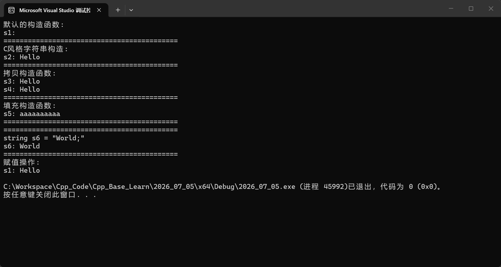
>
> 

****

> * 字符缓冲区构造 和 子串截取构造
>
> ```cpp
> // -------------- 字符缓冲区构造 和 子串截取构造
> 
> #include <iostream>
> #include <string> // string类头文件
> 
> using std::cout;
> using std::endl;
> using std::string; // string类
> 
> int main()
> {
> 	cout << "============================================" << endl;
> 	cout << "字符缓冲区构造:" << endl;
> 	string s1("Hello, World!", 5); // 字符缓冲区构造
> 	// 从字符串"Hello, World!"中截取前5个字符,即"Hello"
> 	cout << "s1: " << s1 << endl; // 输出Hello
> 
> 	cout << "============================================" << endl;
> 	// string (const string& str, size_t pos, size_t len = npos);
> 	// 需要的第一个参数是一个string对象,而不是一个C风格字符串。
> 
> 	cout << "子串截取构造函数: 有pos参数和len参数,len参数不越界" << endl;
> 	string s2("Hello world", 0, 5); // 子串截取构造函数
> 	// 这里会有一个编译器的处理。 
> 	// 这里传入一个C风格字符串,编译器会先把C风格字符串转换成一个临时的string对象,然后再调用子串截取构造函数。
> 	// 从字符串"Hello world"的第0个位置开始截取5个字符,即"Hello"
> 	cout << "s2: " << s2 << endl; // 输出"Hello"
> 
> 	cout << "============================================" << endl;
> 	cout << "子串截取构造函数: 有pos参数和len参数,len参数越界" << endl;
> 	string s3(s2, 1, 8); // 子串截取构造函数
> 	// 没有截取到8个字符,因为s2的长度只有5个字符,所以只截取到第1个位置开始的所有字符,即"ello"
> 	cout << "s3: " << s3 << endl; // 输出ello
> 
> 	cout << "============================================" << endl;
> 	cout << "子串截取构造函数, 有pos参数和len参数,len参数为string::npos" << endl;
> 	string s4(s2, 1, string::npos); // 子串截取构造函数
> 	cout << "s4: " << s4 << endl; // 输出ello
> 
> 	cout << "============================================" << endl;
> 	cout << "问题: 区分 字符缓冲区构造 和 缺省len参数的子串截取构造" << endl;
> 	cout << "============================================" << endl;
> 	// "Hello" 这里是一个C风格字符串,不是一个string对象。
> 	string s5("Hello", 1); // 调用。字符缓冲区构造
> 	cout << "s5: " << s5 << endl; // 输出H
> 	cout << "--------------------------------------------" << endl;
> 	string s6(s2, 1); // 调用。子串截取构造函数
> 	cout << "s6: " << s6 << endl; // 输出ello
> 
> 	return 0;
> }
> 
> ```
>
> VS2026编译器 X64运行的结果：
>
> 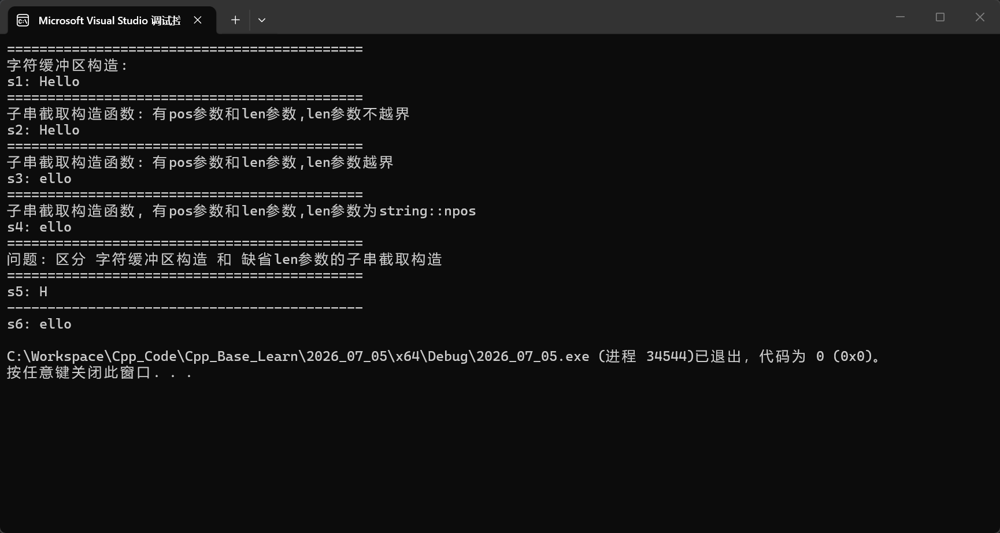


****

> * 了解string::npos
>
> ```cpp
> // -------------- string::npos 是unsigned int的最大值。
> 
> #include <iostream>
> #include <string> // string类头文件
> using std::cout;
> using std::endl;
> using std::string; // string类
> 
> int main()
> {
> 	cout << "============================================" << endl;
> 	cout << "string::npos 是unsigned int的最大值" << endl;
> 	cout << "string::npos: " << string::npos << endl; // 输出4294967295
> 	// VS2026 编译器: X64 : 18446744073709551615
> 	// VS2026 编译器: X86 : 4294967295
> 	return 0;
> }
> ```
>
> * VS2026编译器 X64运行的结果：
>
> 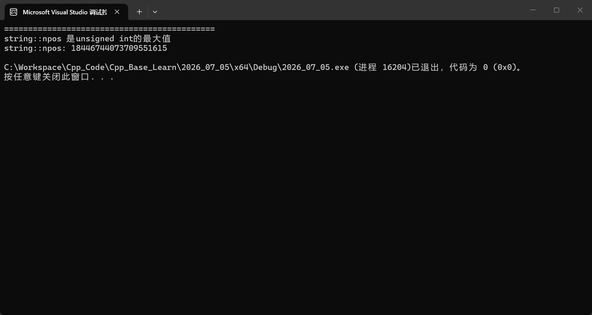
>
> * VS2026编译器 X86运行的结果：
>
> 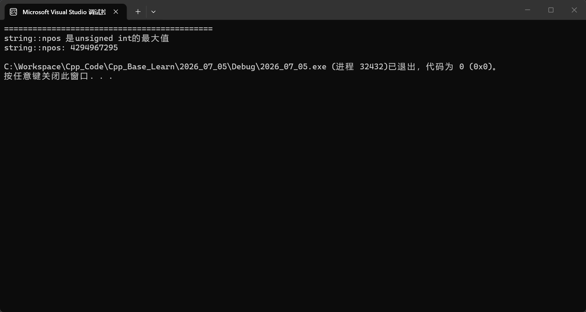


## string对象的遍历

> 遍历使用到的函数。

| 函数                                                         | 作用                                                         |
| ------------------------------------------------------------ | ------------------------------------------------------------ |
| [size()](https://cplusplus.com/reference/string/string/size/) | 获取字符串有效字节长度，和length()作用完全一样，不含末尾'\0' |
| [operator[]](https://cplusplus.com/reference/string/string/operator%5B%5D/) | 通过下标访问字符，下标从0开始，pos等于size()时const串返回'\0' |
| [begin()](https://cplusplus.com/reference/string/string/begin/) | 返回指向字符串第一个字符的迭代器                             |
| [end()](https://cplusplus.com/reference/string/string/end/)  | 返回末尾后一位的迭代器，不能解引用，循环用作结束边界         |

```cpp
// &&&&&&&&&&&&&&&&&&&&&&&&&&&&&&&&&&&&&&&&&&&&&&&&&&&&&&&&&&&&&&&&&&&&&&&&&&&&&&&&&&&&&&&&&&&&&&&&&&&&&&&&&&&&&&&&
// 二: 自己实现字符串的遍历。

#include <iostream>
#include <string> // string类头文件

using std::cout;
using std::endl;
using std::string; // string类

int main()
{
	cout << "============================================" << endl;
	string s1("Hello world");
	cout << "s1: " << s1 << endl; // 输出Hello world
	cout << "s1.size(): " << s1.size() << endl; // 输出11
	cout << "============================================" << endl;
	// 1. 使用[] + 下标 ==> 遍历字符串(推荐使用,最原始。)
	// string类重载了[]运算符,可以通过下标访问每个字符。
	// [] 运算符返回的是一个引用,所以可以修改每个字符。
	// 可以使用[] 运算符修改每个字符。 ==> 写
	for (size_t i = 0; i < s1.size(); ++i)
	{
		s1[i] += 1; // 写。
		cout << s1[i] << " "; // 输出每个字符
	}
	cout << endl;
	// 可以使用[] 运算符读取每个字符。 ==> 读
	for (size_t i = 0; i < s1.size(); ++i)
	{
		cout << s1[i] << " "; // 输出每个字符
	}
	cout << endl;
	cout << "============================================" << endl;

	// 2. 使用迭代器遍历字符串
	string::iterator it = s1.begin();
	// string::iterator 这里的迭代器it是一类似的像指针的东西,可以通过*it访问迭代器指向的字符。
	// 可读可写。
	while (it != s1.end()) // 判断是否到达字符串的末尾
	{
		*it -= 1; // 写。
		cout << *it << " "; // 输出迭代器指向的字符
		++it; // 移动到下一个字符
	}
	cout << endl;
	cout << "============================================" << endl;

	// 3. 范围for遍历字符串 C++11 之后的语法,类似于python的for i in list:
	// 底层的原理是迭代器。
	for (auto ch : s1) // 范围for遍历字符串
	{
		cout << ch << " "; // 输出每个字符
		// 这里的ch是一个值,不是引用,所以不能修改每个字符。
	}
	cout << endl;

	for (auto& ch : s1) // 范围for遍历字符串
	{
		ch += 1; // 写。
		cout << ch << " "; // 输出每个字符
	}
	cout << endl;
	cout << "============================================" << endl;

	return 0;
}
```

> * VS2026编译器X64运行的结果：
>
> 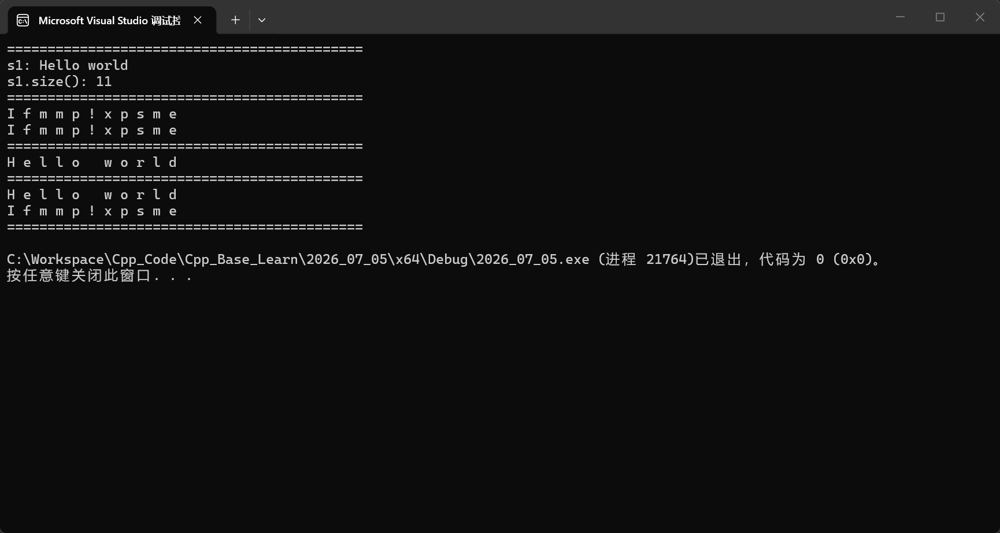


## string中的迭代器

> * 迭代器不一定是指针,像指针一样的东西。
> * 迭代器具有很强的通用性,可以用来遍历各种容器,不仅仅是string类
> * 这里用起来特别像指针。

> 按照迭代器的方向划分
>
> * 正向迭代器
> * 反向迭代器
>
> 按照迭代器的类型划分
>
> * 普通迭代器
> * 常量迭代器

> vector也可以使用迭代器遍历
>
> ```cpp
> #include <iostream>
> #include <vector>
> using std::cout;
> using std::endl;
> using std::vector;
> 
> int main()
> {
> 	// 1. 迭代器不一定是指针,像指针一样的东西。
> 	// 2. 迭代器具有很强的通用性,可以用来遍历各种容器,不仅仅是string类。
> 	vector <int> v1;
> 	v1.push_back(1);
> 	v1.push_back(2);
> 	v1.push_back(3);
> 	v1.push_back(4);
> 	v1.push_back(5);
> 	cout << "===============================================" << endl;
> 	vector<int>::iterator vit = v1.begin();
> 	while (vit != v1.end())
> 	{
> 		cout << *vit << " "; // 输出迭代器指向的元素
> 		++vit; // 移动到下一个元素
> 	}
> 	cout << endl;
> 	cout << "===============================================" << endl;
> 	
> 	return 0;
> }
> //===============================================
> //1 2 3 4 5
> //===============================================
> ```


### 普通的正向迭代器

```cpp
// 1. 普通的正向迭代器。

#include <iostream>
#include <string> // string类头文件

using std::cout;
using std::endl;
using std::string; // string类

void func(string& s) // 传引用,可以修改字符串,可以提高效率,避免拷贝构造。
{
	string::iterator it = s.begin(); // 获取字符串的开始迭代器
	while (it != s.end()) // 判断是否到达字符串的末尾
	{
		*it -= 1; // 修改。
		++it; // 移动到下一个字符
	}
	cout << endl;
	// 读。
	it = s.begin(); // 获取字符串的开始迭代器
	while (it != s.end()) // 判断是否到达字符串的末尾
	{
		cout << *it << " "; // 输出迭代器指向的字符
		++it; // 移动到下一个字符
	}
	cout << endl;
}

int main()
{
	string s1("Hello world");
	cout << "=============================================" << endl;
	func(s1);
	cout << "=============================================" << endl;
	return 0;
}
```

> VS2026的X64的编译器下面的结果：
>
> 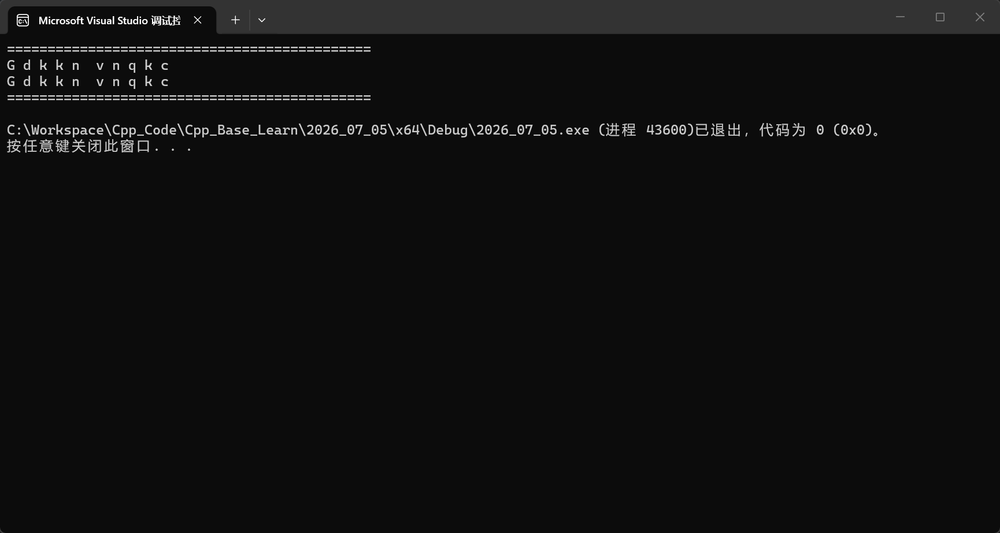


### 普通反向迭代器

| 函数                                                         | 作用                                                         |
| ------------------------------------------------------------ | ------------------------------------------------------------ |
| [rbegin()](https://cplusplus.com/reference/string/string/rbegin/) | 返回反向迭代器，指向字符串最后一个字符，用于倒序遍历         |
| [rend()](https://cplusplus.com/reference/string/string/rend/) | 返回反向末尾迭代器，指向第一个字符的前一位，不能解引用，倒序循环边界 |

```cpp
// 2. 普通的反向迭代器。

#include <iostream>
#include <string> // string类头文件

using std::cout;
using std::endl;
using std::string; // string类

int string2int(string& numstr)
{
	int val = 0;
	int base = 1;
	string::reverse_iterator rit = numstr.rbegin();
	while (rit != numstr.rend())
	{
		val += (*rit - '0') * base;
		base *= 10;
		++rit;
	}
	return val;
}

int main()
{
	string s1("123456");
	int n = string2int(s1);
	cout << "n: " << n << endl; // 输出123456
	return 0;
}
```

> VS2026的X64的编译器下面的结果：
>
> 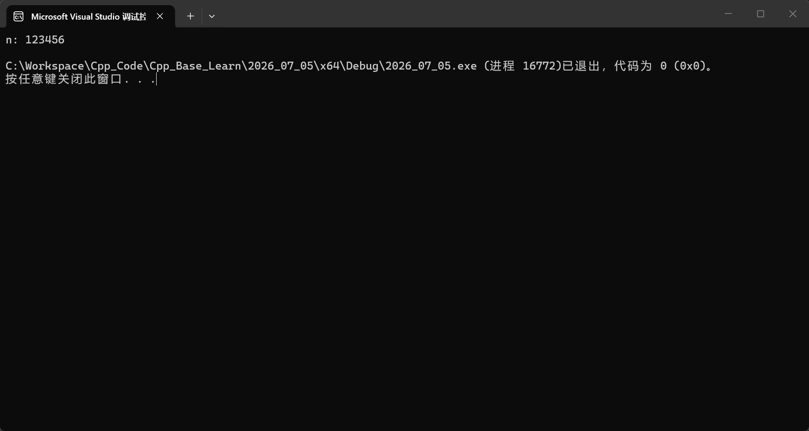


### 正向的常量迭代器

```cpp
// 3. 正向的常量迭代器

#include <iostream>
#include <string> // string类头文件

using std::cout;
using std::endl;
using std::string; // string类

int string2int(const string& numstr)
{
	int val = 0;
	string::const_iterator it = numstr.begin();
	while (it != numstr.end())
	{
		val *= 10;
		val += (*it - '0');
		++it;
	}
	return val;
}

int main()
{
	string s1("123456");
	int n = string2int(s1);
	cout << "n: " << n << endl; // 输出123456
	return 0;
}
```

> VS2026的X64的编译器下面的结果：
>
> 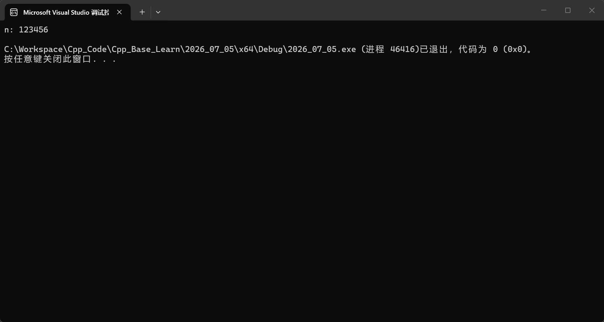


### 反向的常量迭代器

```cpp
// 4. 反向的常量迭代器

#include <iostream>
#include <string> // string类头文件

using std::cout;
using std::endl;
using std::string; // string类

// 使用引用,同时使用const修饰。
int string2int(const string& numstr)
{
	int val = 0;
	int base = 1;
	// string::const_reverse_iterator rit = numstr.rbegin();
    auto it = numstr.rbegin(); // C++11 之后可以使用 auto 自动推导类型
	while (rit != numstr.rend())
	{
		val += (*rit - '0') * base;
		base *= 10;
		++rit;
	}
	return val;
}

int main()
{
	string s1("123456");
	int n = string2int(s1);
	cout << "n: " << n << endl; // 输出123456
	return 0;
}
```

> VS2026的X64的编译器下面的结果：
>
> 


## string类对象的容量操作

| 函数名称                                                     | 函数功能                                       |
| ------------------------------------------------------------ | ---------------------------------------------- |
| [size()](https://cplusplus.com/reference/string/string/size/) | 返回字符串有效字符长度                         |
| [lenth()](https://cplusplus.com/reference/string/string/length/) | 返回字符串有效字符长度                         |
| [max_size()](https://cplusplus.com/reference/string/string/max_size/) | 返回字符串的最大长度                           |
| [capacity()](https://cplusplus.com/reference/string/string/capacity/) | 返回字符串有效字符的容量                       |
| [clear()](https://cplusplus.com/reference/string/string/clear/) | 清空字符串                                     |
| [empty()](https://cplusplus.com/reference/string/string/empty/) | 判断字符串是否为空                             |
| [reserve()](https://cplusplus.com/reference/string/string/reserve/) | 为字符串预留空间                               |
| [resize()](https://cplusplus.com/reference/string/string/resize/) | 将有效字符的个数该成n个，多出的空间用字符c填充 |


### 容量操作常用函数

> * size()
> * lenth()
> * max_size()
> * capacity()
> * clear()
> * empty()

```cpp
#include <iostream>
#include <string> // string类头文件

using std::cout;
using std::endl;
using std::string; // string类

int main()
{
	string s1("Hello world");
	string s2("Hello");
	cout << "=============================================" << endl;
	cout << "size() : 返回字符串的长度" << endl;
	cout << "s1: " << s1 << endl; // 输出Hello world
	// (1):计算长度。
	cout << "s1.size(): " << s1.size() << endl; // 输出11
	
	cout << "=============================================" << endl;
	cout << "length() : 返回字符串的长度" << endl;
	// (2):求: length
	cout << "s1.length(): " << s1.length() << endl; // 输出11
	
	cout << "=============================================" << endl;
	cout << "max_size() : 返回字符串的最大长度" << endl;
	// (3): 最大长度。 ==> 没有什么意义。
	cout << "s1.max_size(): " << s1.max_size() << endl;
	// VS2026 编译器:
	// X64: 9223372036854775807
	// X86: 2147483647

	cout << "=============================================" << endl;
	cout << "capacity() : 返回字符串的容量" << endl;
	// (4) : capacity() : 容量
	cout << "s1.capacity(): " << s1.capacity() << endl; // 输出15
	cout << "s2.capacity(): " << s2.capacity() << endl; // 输出15

	cout << "=============================================" << endl;
	cout << "clear() : 清空字符串" << endl;
	// (5): clear() : 清空字符串
	// clear() : 清空字符串,只是把size这些变成0了,但是不改变容量。
	s1.clear();
	cout << "s1: " << s1 << endl; // 输出空字符串
	cout << "s1.size(): " << s1.size() << endl; // 输出0
	cout << "s1.capacity(): " << s1.capacity() << endl; // 输出15

	cout << "=============================================" << endl;
	cout << "empty() : 判断字符串是否为空" << endl;
	// (6): empty() : 判断字符串是否为空
	cout << "s1.empty(): " << s1.empty() << endl; // 输出1
	cout << "s2.empty(): " << s2.empty() << endl; // 输出0

	return 0;
}
```

> VS2026的X64的编译器下面的结果：
>
> 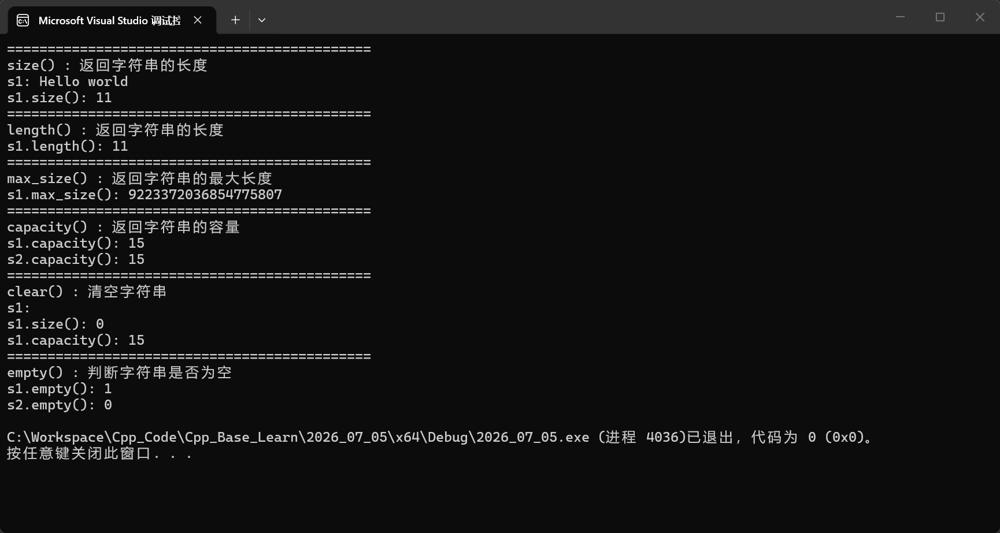


### 深入了解capacity()

> * capacity()
> * 原型：size_t capacity() const;
> * 返回当前已经分配的有效内存总字节容量，大于等于size()
> * 代表不用重新扩容就能存放的最大字符数量，可以配合reserve修改

> string对象在开空空间的时候,会考虑内存对齐的问题,所以申请的空间可能会比实际需要的空间大一些,以提高效率。
>
> 例如: 申请100个字节的空间,可能会申请111个字节的空间,因为考虑了内存对齐的问题。
>
> 同时还会在后面多开一个用于存储'\0'。

#### VS2026编译器的X64环境

```cpp
#include <iostream>
#include <string> // string类头文件

using std::cout;
using std::endl;
using std::string; // string类

// string对象在开空空间的时候,会考虑内存对齐的问题,所以申请的空间可能会比实际需要的空间大一些,以提高效率。
// 例如: 申请100个字节的空间,可能会申请111个字节的空间,因为考虑了内存对齐的问题。
// 同时还会在后面多开一个用于存储'\0'。
int main()
{
	string s;
	size_t sz = s.capacity();
	cout << "making s grow:\n";
	cout << "capacity original: " << sz << endl;
	size_t last_capacity = sz; // 记录上一次的容量。
	double growth_factor = 1.0; // 记录增长因子。
	for (int i = 0; i < 1000; ++i)
	{
		s.push_back('x');
		if (sz != s.capacity())
		{
			sz = s.capacity();
			growth_factor = static_cast<double>(sz) / last_capacity; // 计算增长因子
			cout << "capacity changed: " << sz << " (growth factor: " << growth_factor << ")" << endl;
			last_capacity = sz;
		}
	}
	return 0;
}
```

> 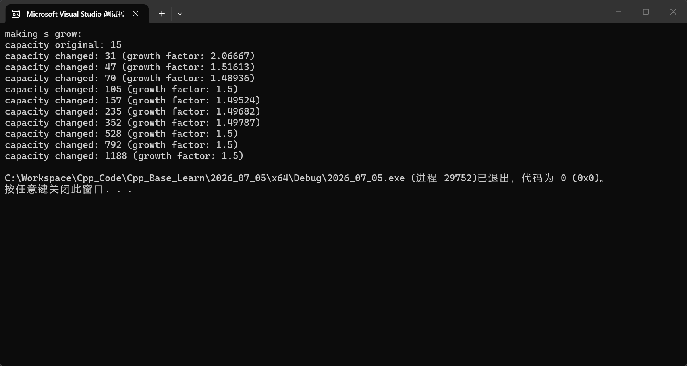
>
> * 发现每一次扩容的增长因子大约是1.5倍。
> * 这样不会频繁的申请内存,提高了效率。


#### gcc编译器

> 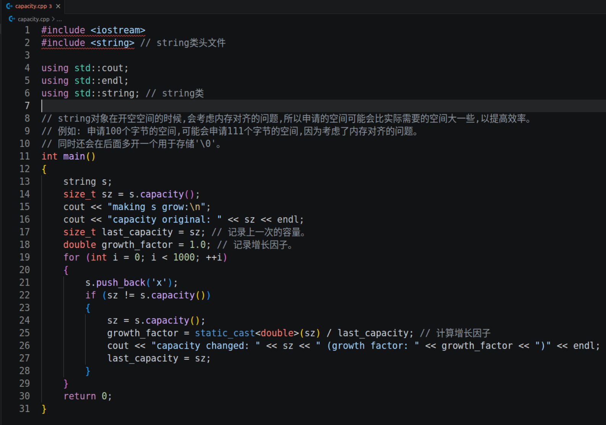

> 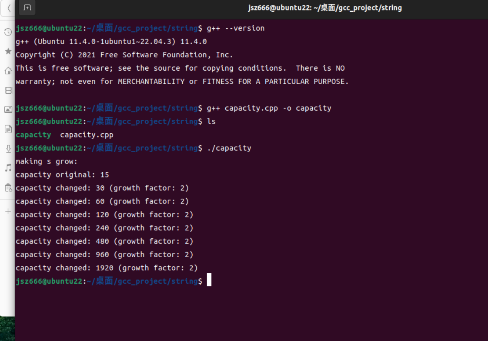
>
> * 发现每一次扩容的增长因子是2倍。


### reserve()

> * 直接预留n个字符的空间,避免频繁申请内存。
> * string对象在开空空间的时候,会考虑内存对齐的问题,所以申请的空间可能会比实际需要的空间大一些,以提高效率。
> * 例如: 申请100个字节的空间,可能会申请111个字节的空间,因为考虑了内存对齐的问题。
> * 同时还会在后面多开一个用于存储'\0'。

```cpp
#include <iostream>
#include <string> // string类头文件

using std::cout;
using std::endl;
using std::string; // string类

int main()
{
	string s; // 创建一个空字符串对象.
	s.reserve(100); // 预留100个字符的空间,避免频繁申请内存。
	size_t sz = s.capacity(); 
	cout << "making s grow:\n";
	cout << "capacity original: " << sz << endl;
	// capacity original : 111
	// 这里的111是因为考虑了内存对齐的问题,所以申请的空间可能会比实际需要的空间大一些,以提高效率。
	// 实际上开辟了112个字节的空间,因为还要多开一个用于存储'\0'。
	cout << "s.size(): " << s.size() << endl;
	// s.size(): 0
	// reserve() : 预留空间,不会改变字符串的大小,所以s.size() = 0;
	for (int i = 0; i < 100; ++i)
	{
		s.push_back('x');
		if (sz != s.capacity())
		{
			sz = s.capacity();
			cout << "capacity changed: " << sz << endl;
		}
	}
	cout << "--------------------------------------------" << endl;
	cout << "循环结束" << endl;
	cout << "s.size(): " << s.size() << endl; // 输出100

	return 0;
}
```

> 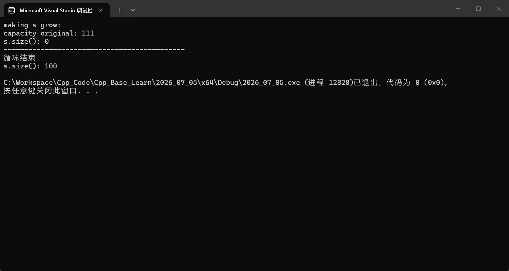

### resize()

> * void resize (size_t n);void resize (size_t n, char c);
> * 修改有效字符数量（size），会生成 / 销毁字符；
> * 若 n 小于当前字符串长度：截断至前 n 个字符，移除第 n 位之后所有字符。
> * 若 n 大于当前字符串长度：在末尾插入字符补齐至长度 n；
> * 如果指定字符 c，新增元素用 c 填充；否则使用值初始化字符（空字符 \0）。

```cpp
#include <iostream>
#include <string> // string类头文件

using std::cout;
using std::endl;
using std::string; // string类

void test_resize()
{
	string s1("Hello world");
	s1.resize(5);
	cout << "s1: " << s1 << endl; // 输出Hello
	s1.resize(10);
	cout << "s1: " << s1 << endl; // 输出Hello
	s1.resize(20, 'A');
	cout << "s1: " << s1 << endl; // 输出HelloAAAAA
}

int main()
{
	// 默认使用'\0'填充。
	cout << "=============================================" << endl;
	string s1; 
	cout << "s1: " << s1 << endl; // 输出空字符串
	cout << "s1.size(): " << s1.size() << endl; // 输出0
	cout << "s1.capacity(): " << s1.capacity() << endl; // 输出15
	cout << "--------------------------------------------" << endl;
	s1.resize(5);
	cout << "s1: " << s1 << endl; // 输出空字符串,因为默认填充'\0'字符,所以看不到字符。
	cout << "s1.size(): " << s1.size() << endl; // 输出5
	cout << "s1.capacity(): " << s1.capacity() << endl; // 输出15
	cout << "=============================================" << endl;
	// 使用'A'填充。
	cout << "=============================================" << endl;
	string s2;
	cout << "s2: " << s2 << endl; // 输出空字符串
	cout << "s2.size(): " << s2.size() << endl; // 输出0
	cout << "s2.capacity(): " << s2.capacity() << endl; // 输出15
	cout << "--------------------------------------------" << endl;
	s2.resize(100, 'A');
	cout << "s2: " << s2 << endl; 
	cout << "s2.size(): " << s2.size() << endl; 
	cout << "s2.capacity(): " << s2.capacity() << endl; 
	cout << "=============================================" << endl;
	// 字符串的截断。
	cout << "=============================================" << endl;
	string s3("Hello world");
	cout << "s3: " << s3 << endl; // 输出Hello world
	cout << "s3.size(): " << s3.size() << endl; // 输出11
	cout << "s3.capacity(): " << s3.capacity() << endl; // 输出15
	cout << "--------------------------------------------" << endl;
	s3.resize(5);
	cout << "s3: " << s3 << endl; 
	cout << "s3.size(): " << s3.size() << endl; 
	cout << "s3.capacity(): " << s3.capacity() << endl; 
	cout << "=============================================" << endl;
	return 0;
}
```

> 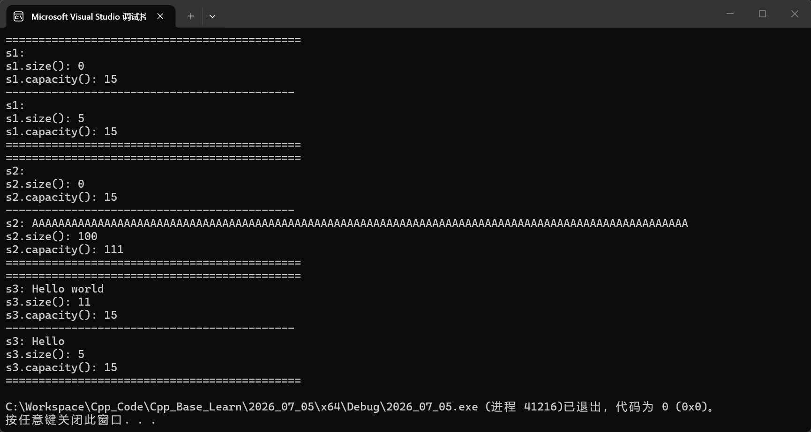


## 字符串的练习题


### [仅仅反转字母,其他字符不变](https://leetcode.cn/problems/reverse-only-letters/description/)

> 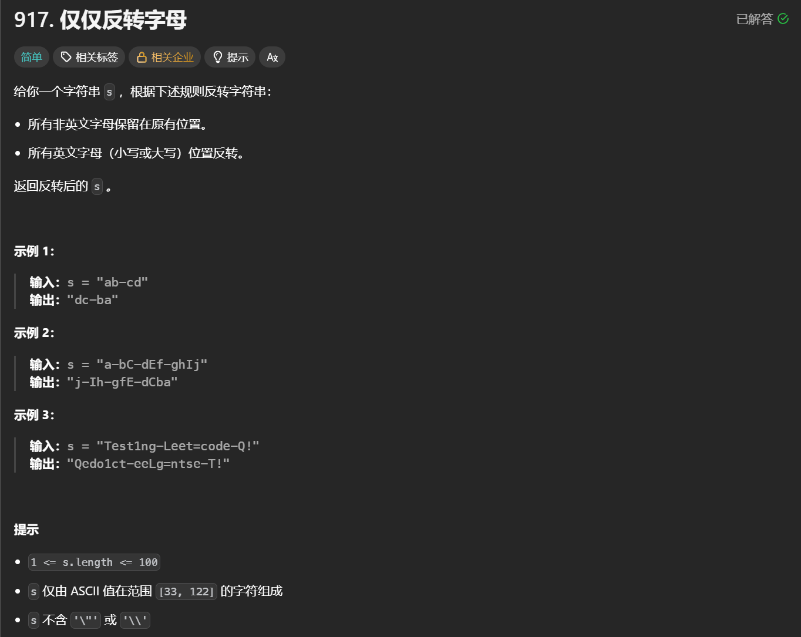
>
> ```cpp
> #include <string> // string类头文件
> using std::string; // string类
> using std::swap; // swap函数
> 
> class Solution
> {
> public:
>     string reverseOnlyLetters(string s)
>     {
> 		int begin = 0;
> 		int end = s.size() - 1;
> 		while (begin < end)
> 		{
> 			while ((begin < end) && (IsChar(s[begin]) == false))
> 			{
> 				++begin;
> 			}
> 			// 找到了begin指向的字符是字母。
> 			while ((begin < end) && (IsChar(s[end]) == false))
> 			{
> 				--end;
> 			}
> 			// 找到了end指向的字符是字母。
> 			swap(s[begin], s[end]); // C++直接使用。
> 			begin++; // 这里是交换完了,所以要移动到下一个位置。
> 			end--; // 这里是交换完了,所以要移动到下一个位置。
> 		}
> 		return s;
>     }
> private:
> 	inline bool IsChar(char c)
> 	{
> 		if ((c >= 'a' && c <= 'z') || (c >= 'A' && c <= 'Z'))
> 		{
> 			return true;
> 		}
> 		else
> 		{
> 			return false;
> 		}
> 	}
> };
> ```


### [字符串中的第一个唯一字符](https://leetcode.cn/problems/first-unique-character-in-a-string/description/)

> 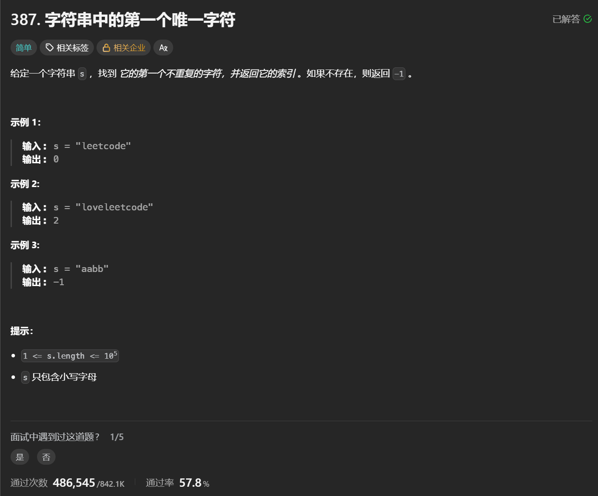
>
> ```cpp
> #include <string> // string类头文件
> using std::string; // string类
> 
> class Solution
> {
> public:
>     // 使用映射的方法统计次数。
>     int firstUniqChar(string s)
>     {
> 		int count[26] = { 0 }; // 统计每个字母出现的次数
> 		for (char c : s) // 遍历字符串
> 		{
> 			count[c - 'a']++; // 统计每个字母出现的次数
> 		}
> 		for (size_t i = 0; i < s.size(); ++i)
> 		{
> 			if (count[s[i] - 'a'] == 1) // 如果该字母只出现过一次
> 			{
> 				return i; // 返回该字母的下标
> 			}
> 		}
> 		return -1; // 如果没有唯一字符，返回-1
>     }
> };
> ```

