# AVL 树


## 1. AVL 树的概念

AVL 树是一棵**高度平衡的二叉搜索树**。

它首先是一棵二叉搜索树，因此满足二叉搜索树的基本性质：

- 对于树中的任意一个节点，它的左子树中所有节点的值都小于该节点的值。
- 对于树中的任意一个节点，它的右子树中所有节点的值都大于该节点的值。
- 它的左右子树也分别是一棵二叉搜索树。

普通二叉搜索树在理想情况下可以提高查找效率，但是如果插入的数据接近有序，树就可能退化成单链表。例如依次插入 `1, 2, 3, 4, 5`，节点会不断往右边插入，树的高度接近节点个数，查找效率就会退化为 `O(N)`。

为了解决这个问题，AVL 树在二叉搜索树的基础上增加了一个平衡条件：

> 对于树中的任意一个节点，它的左子树和右子树的高度差的绝对值不超过 `1`。

也就是说，一棵 AVL 树需要同时满足两个条件：

- 它是一棵二叉搜索树。
- 它的每一棵子树都满足高度平衡。

为了方便判断一棵树是否平衡，AVL 树通常会在每个节点中保存一个**平衡因子**。

在这里，我们采用的平衡因子定义是：

```cpp
平衡因子 = 右子树高度 - 左子树高度
```

因此，对于一棵正常平衡的 AVL 树来说，每个节点的平衡因子只可能是：

```text
-1  0  1
```

它们分别表示：

| 平衡因子 | 含义 |
| --- | --- |
| `-1` | 左子树比右子树高 1 |
| `0` | 左右子树一样高 |
| `1` | 右子树比左子树高 1 |

如果某个节点的平衡因子变成 `2` 或 `-2`，就说明以该节点为根的子树已经不平衡，需要通过旋转来调整树的结构。

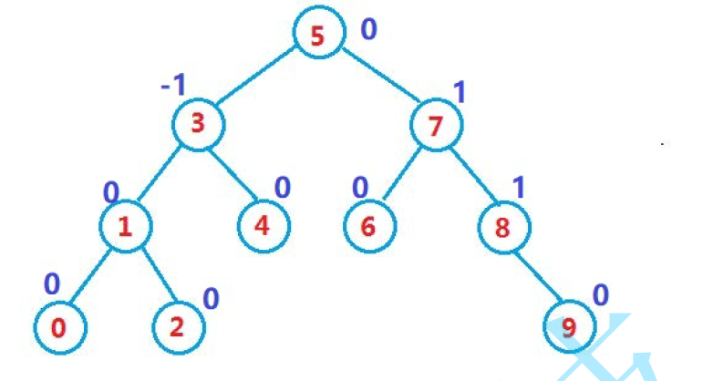

AVL 树通过维护高度平衡，可以把树的高度控制在 `O(logN)` 级别，因此查找、插入、删除的效率都可以保持在 `O(logN)`。


## 2. AVL 树节点的定义

> * 在实现 AVL 树之前，需要先定义树中的节点。
> * 这里先实现的以是 **key 模型** 的 AVL 树节点，也就是每个节点中只存储一个键值 `key`。
>
> ``````cpp
> // key模型的AVL树的节点。
> template <class K>
> class KAVLTreeNode
> {
> public:
> 	KAVLTreeNode<K>* _left; // 左
> 	KAVLTreeNode<K>* _right; // 右
> 	KAVLTreeNode<K>* _parent; // 父
> 	int _bf; // 平衡因子
> 	K _key; // 键
> 	KAVLTreeNode(const K& key = K())
> 		: _left(nullptr)
> 		, _right(nullptr)
> 		, _parent(nullptr)
> 		, _bf(0)
> 		, _key(key)
> 	{}
> };
> ``````
>
> 


## 3. AVL树的插入


### 3.1   按照二叉搜索树的规则插入新节点

```cpp
// AVL树的插入操作。
bool insert(const K& key) // 插入函数。
{
	// (1). 先按照搜索二叉树的规则进行插入。
	if (_root == nullptr)
	{
		_root = new Node(key);
		return true;
	}
	Node* parent = nullptr;
	Node* cur = _root;
	while (cur)
	{
		if (key < cur->_key) // 去左边找。
		{
			parent = cur;
			cur = cur->_left;
		}
		else if (key > cur->_key) // 去右边找。
		{
			parent = cur;
			cur = cur->_right;
		}
		else
		{
			return false; // 不允许插入重复的键值对。
		}
	}
	cur = new Node(key);
	if (key < parent->_key)
	{
		parent->_left = cur;
	}
	else
	{
		parent->_right = cur;
	}
	cur->_parent = parent; // 连接parent

	// (2). 更新祖先节点的平衡因子。
	// (3). 如果出现不平衡,就进行旋转处理。
}
```


### 3.2  更新祖先节点的平衡因子

新节点已经按照二叉搜索树的规则插入到树中以后，AVL 树还不能直接结束。因为这次插入可能会改变某些子树的高度，而 AVL 树判断是否平衡，看的正是左右子树的高度差。

> **先记住一句话：插入节点只会影响它的祖先节点。**  
> 新节点插入在哪里，只有从这个新节点一路往上到根节点的这条路径，高度才可能发生变化。其他分支没有新增节点，高度不变，平衡因子也就不需要更新。
>
> 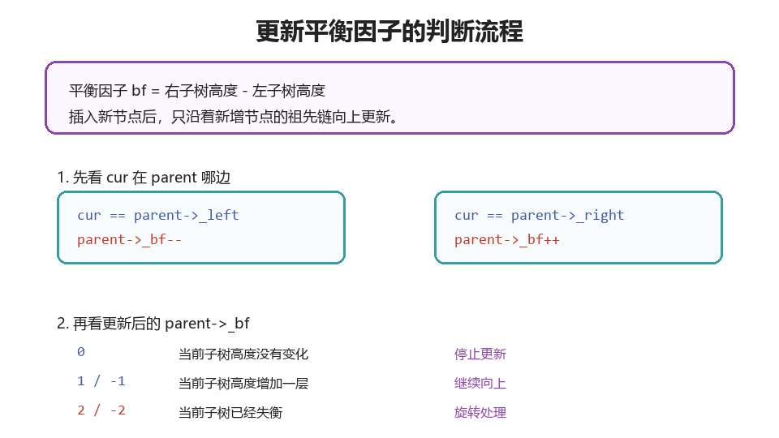
>
> 
>
>
> 插入完成后，代码会从新节点的父节点开始向上走：
>
> > ``````cpp
> > while (parent)
> > {
> >     if (cur == parent->_left)
> >     {
> >         parent->_bf--;
> >     }
> >     else
> >     {
> >         parent->_bf++;
> >     }
> >     // 根据 parent->_bf 的结果决定停止、继续，还是旋转
> > }
> > ``````
> >
> > 

****

**第一步：判断 `cur` 在 `parent` 的哪一边。**  

> * 平衡因子的作用就是用来衡量树有没有出现问题的。
> * 出问题了就是不平衡，需要处理。
>
> 本文使用的平衡因子定义是： 
>
> ``````cpp
> // 平衡因子 = 右子树高度 - 左子树高度
> ``````
>
> * 所以，如果 `cur` 在 `parent` 的左边，说明左子树高度可能增加，`parent->_bf--`；
> * 如果 `cur` 在 `parent` 的右边，说明右子树高度可能增加，`parent->_bf++`。
>
> | `cur` 的位置            | 说明                           | 平衡因子变化    |
> | ----------------------- | ------------------------------ | --------------- |
> | `cur == parent->_left`  | 插入到了 `parent` 的左子树方向 | `parent->_bf--` |
> | `cur == parent->_right` | 插入到了 `parent` 的右子树方向 | `parent->_bf++` |

****

**第二步：看更新后的 `parent->_bf`。**  

> | 更新后的 `parent->_bf` | 对应代码分支                                      | 含义                   | 接下来怎么做       |
> | ---------------------- | ------------------------------------------------- | ---------------------- | ------------------ |
> | `0`                    | `if (parent->_bf == 0)`                           | 当前子树高度没有变化   | 停止更新           |
> | `1` 或 `-1`            | `else if (parent->_bf == 1 || parent->_bf == -1)` | 当前子树高度增加了一层 | 继续向上           |
> | `2` 或 `-2`            | `else if (parent->_bf == 2 || parent->_bf == -2)` | 当前子树已经失衡       | 停止向上，旋转处理 |
>

****

> **情况一：`parent->_bf == 0`，更新结束。**
>
> > * 更新完以后,如果parent->_bf == 0,表示parent的高度没有变,后面就不会影响上面的祖先了。
> > * 解释:更新前,parent的bf是1或者-1,现在变成了0,说明把矮的那一边填上了;
> > * 说明parent所在的高度不变,对上一层没有影响
>
>  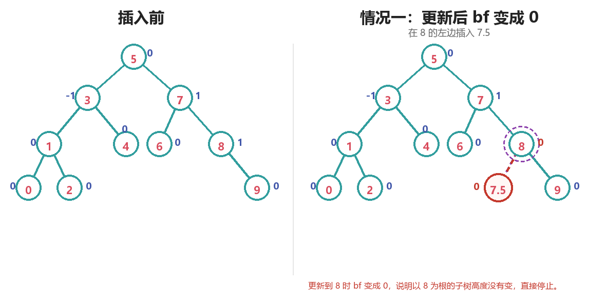
> 
> 
>`8` 的平衡因子变成 `0`，说明以 `8` 为根的子树高度没有变化。既然这棵子树的高度没有变，那么它的父节点 `7` 就不会继续受到影响，更新到这里就可以停止。

*****

> **情况二：`parent->_bf == 1 || parent->_bf == -1`，继续向上。**
>
> * 更新完parent的bf,如果parent-->bf == 1或者-1,说明parent的高度变高了,继续往上更新。
> * 说明更新前,parent的平衡因子是0,现在变成了1或者-1,
> * 说明变高了,对上层有影响
>
> 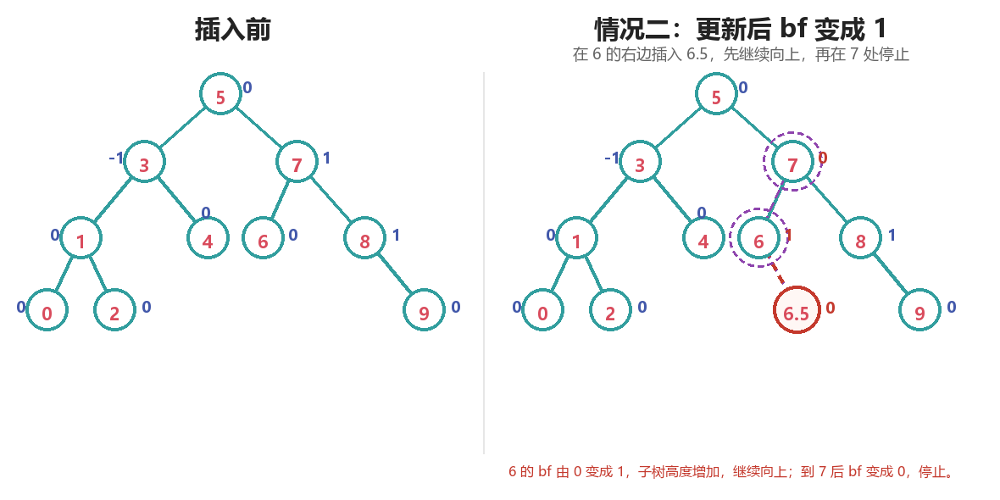
> 
> 
>`6` 的平衡因子从 `0` 变成 `1`，说明以 `6` 为根的子树高度增加了一层。因此不能停，要继续向上更新 `7`。
> 
>更新到 `7` 后，平衡因子变成 `0`，说明以 `7` 为根的子树高度没有变化，所以不需要继续更新到 `5`。

****

> **情况三：`parent->_bf == 2 || parent->_bf == -2`，旋转处理。**
>
> 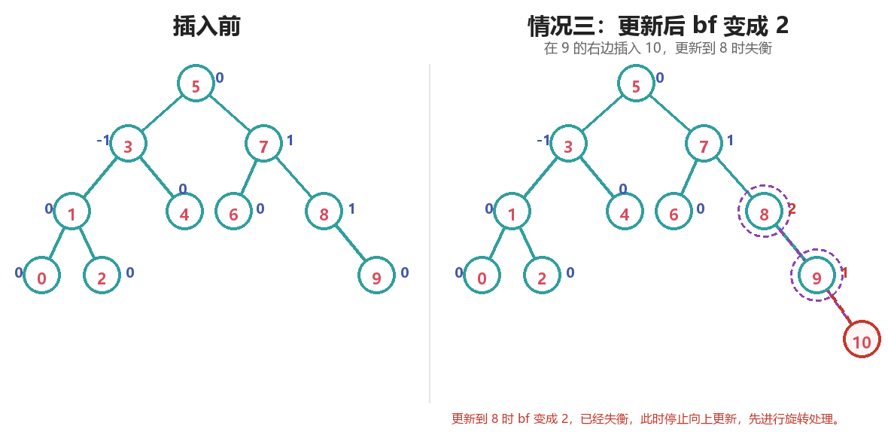

*****


### 3.3  如果出现不平衡，就进行旋转处理

当插入新节点以后，某个祖先节点的平衡因子被更新成 `2` 或 `-2`，就说明以这个祖先节点为根的子树已经失衡。此时不能继续单纯向上更新平衡因子，而是要先通过旋转把这棵子树调整回来。

> **旋转要解决两个问题：**  
> 第一，旋转完成后，它还必须是一棵二叉搜索树；
>
> 第二，旋转完成后，这棵子树要重新恢复平衡。  
> 所以旋转不是随便换位置，而是在不破坏中序关系的前提下，调整子树高度。

在插入场景中，常见的失衡可以分成四类：

| 失衡方向 | 插入位置 | 旋转方式 |
| --- | --- | --- |
| 右子树的右侧变高 | RR 型 | 左单旋 |
| 左子树的左侧变高 | LL 型 | 右单旋 |
| 右子树的左侧变高 | RL 型 | 右左双旋 |
| 左子树的右侧变高 | LR 型 | 左右双旋 |


#### 3.3.1 左单旋

> * 分别从一颗空树，依次插入1，2，3，4，5，6，7 这些节点。
>
> 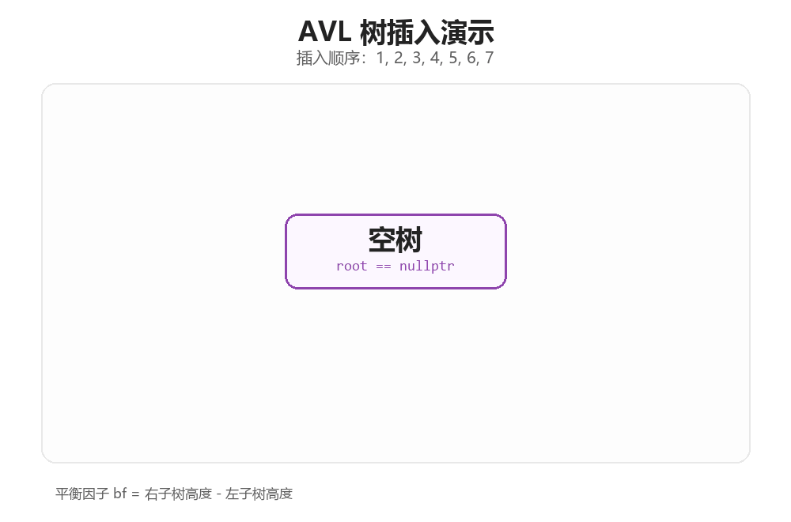
> 
> 
>* 新节点插入较高右子树的右侧
> 
>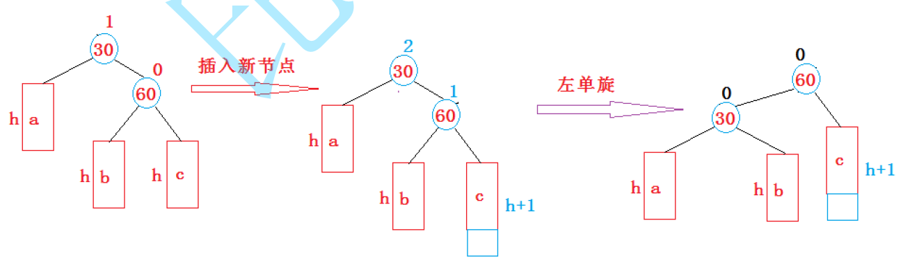
> 
>> ```cpp
> > void RotateL(Node* parent)
> > {
> > 	Node* subR = parent->_right; // 右子树
> > 	Node* subRL = subR->_left; // 右子树的左子树
> > 	Node* GrandParent = parent->_parent; // 父节点的父节点
> > 	int flag = 0;
> > 	if (GrandParent)
> > 	{
> > 		if (GrandParent->_left == parent)
> > 		{
> > 			flag = -1; // parent是GrandParent的左子树
> > 		}
> > 		else
> > 		{
> > 			flag = 1; // parent是GrandParent的右子树
> > 		}
> > 	}
> > 	else // parent是根节点。
> > 	{
> > 		flag = 0; // 根节点
> > 	}
> > 	parent->_right = subRL;
> > 	if (subRL) // subRL不为空,则连接parent
> > 	{
> > 		subRL->_parent = parent;
> > 	}
> > 	subR->_left = parent;
> > 	parent->_parent = subR;
> > 	if (flag == -1)
> > 	{
> > 		GrandParent->_left = subR;
> > 		subR->_parent = GrandParent;
> > 	}
> > 	else if (flag == 1)
> > 	{
> > 		GrandParent->_right = subR;
> > 		subR->_parent = GrandParent;
> > 	}
> > 	else
> > 	{
> > 		_root = subR; // 根节点
> > 		subR->_parent = nullptr;
> > 	}
> > 	parent->_bf = subR->_bf = 0; // 更新平衡因子
> > }
> > ```


****


#### 3.3.2 右单旋

> * 新节点插入较高左子树的左侧
>
> 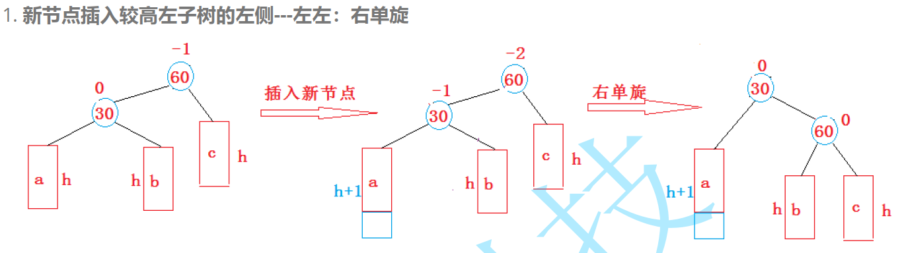
>
> > ```cpp
> > void RotateR(Node* parent)
> > {
> > 	Node* subL = parent->_left; // 左子树
> > 	Node* subLR = subL->_right; // 左子树的右子树
> > 	Node* GrandParent = parent->_parent; // 父节点的父节点
> > 	int flag = 0;
> > 	if (GrandParent)
> > 	{
> > 		if (GrandParent->_left == parent)
> > 		{
> > 			flag = -1; // parent是GrandParent的左子树
> > 		}
> > 		else
> > 		{
> > 			flag = 1; // parent是GrandParent的右子树
> > 		}
> > 	}
> > 	else // parent是根节点。
> > 	{
> > 		flag = 0; // 根节点
> > 	}
> > 	parent->_left = subLR;
> > 	if (subLR) // subLR不为空,则连接parent
> > 	{
> > 		subLR->_parent = parent;
> > 	}
> > 	subL->_right = parent;
> > 	parent->_parent = subL;
> > 	if (flag == -1)
> > 	{
> > 		GrandParent->_left = subL;
> > 		subL->_parent = GrandParent;
> > 	}
> > 	else if (flag == 1)
> > 	{
> > 		GrandParent->_right = subL;
> > 		subL->_parent = GrandParent;
> > 	}
> > 	else
> > 	{
> > 		_root = subL; // 根节点
> > 		subL->_parent = nullptr;
> > 	}
> > 	parent->_bf = subL->_bf = 0; // 更新平衡因子
> > }
> > ```


****


#### 3.3.3 左右双旋

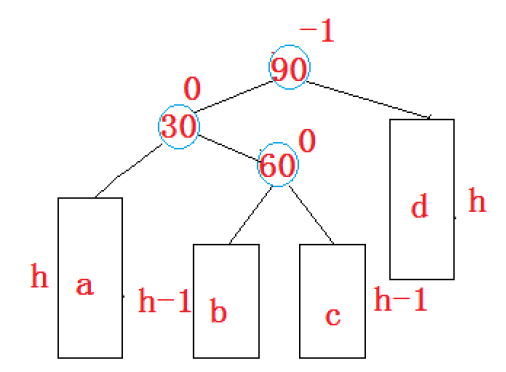

> * 新节点插入较高左子树的右侧
>
> ****
>
> * 情况1：在b插入一个新的节点
>
> > 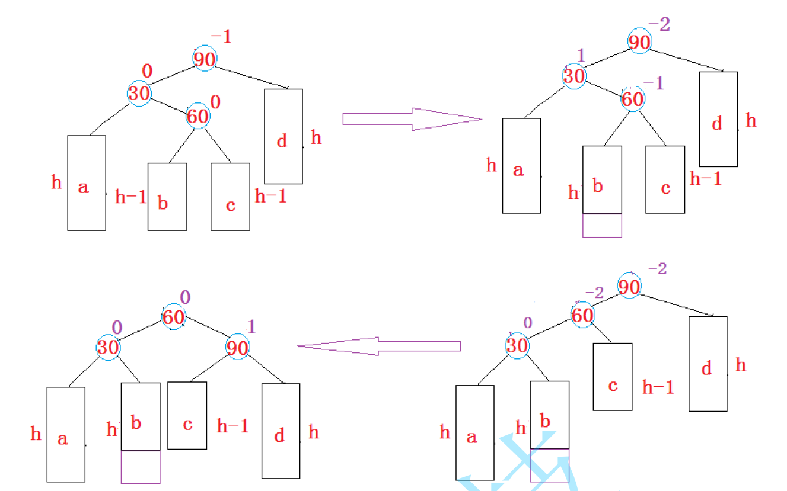
>
> ****
>
> * 情况2：在c插入一个新的节点：
>
>   > 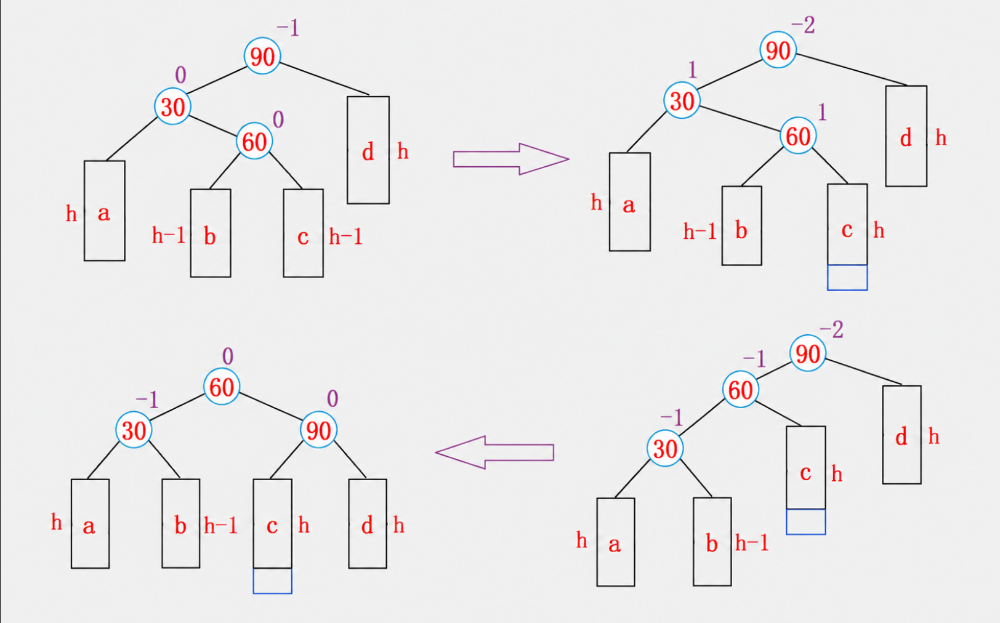
>
> ****
>
> * 情况3：特殊情况：a，b，c，d都是空树。
>
> > 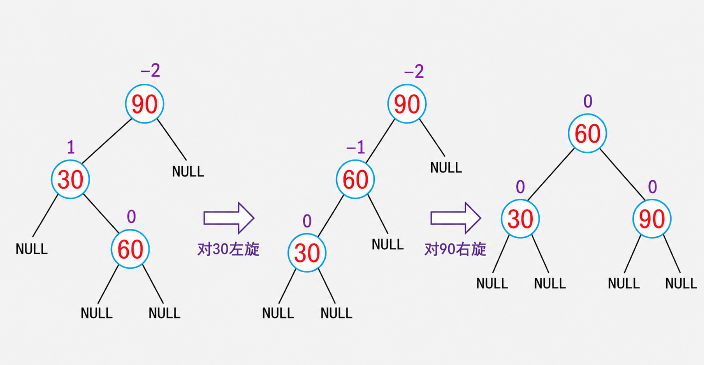
>
> *****
>
> > ``````cpp
> > void RotateLR(Node *parent) // 左右双旋
> > {
> >     Node *subL = parent->_left;
> >     Node *subLR = subL->_right;
> >     int bf_subLR = subLR->_bf;
> >     RotateL(subL);
> >     RotateR(parent);
> >     if (bf_subLR == -1) // 在b插入。
> >     {
> >         parent->_bf = 1;
> >         subL->_bf = 0;
> >         subLR->_bf = 0;
> >     }
> >     else if (bf_subLR == 1) // 在c插入。
> >     {
> >         parent->_bf = 0;
> >         subL->_bf = -1;
> >         subLR->_bf = 0;
> >     }
> >     else // subLR是新插入的节点。
> >     {
> >         parent->_bf = 0;
> >         subL->_bf = 0;
> >         subLR->_bf = 0;
> >     }
> > }
> > ``````


#### 3.3.4 右左双旋

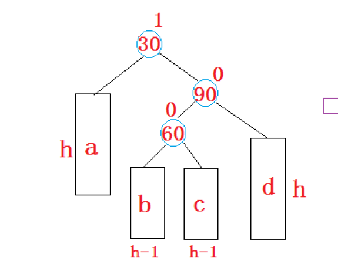

> * 新节点插入较高右子树的左侧
>
> ****
>
> * 情况1：在b插入一个新的节点
>
> > 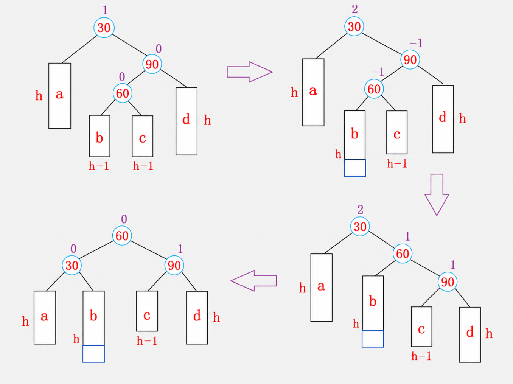
>
> ****
>
> * 情况2：在c插入一个新的节点
>
> > 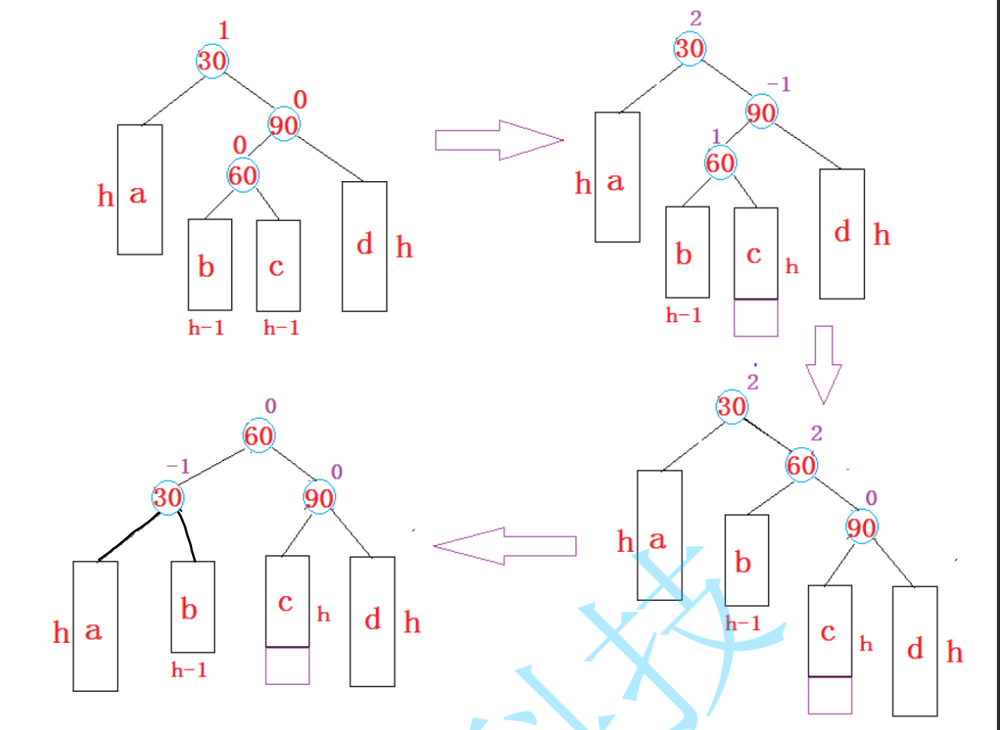
>
> ****
>
> * 情况3：特殊情况：a，b，c，d都是空树。
>
> > 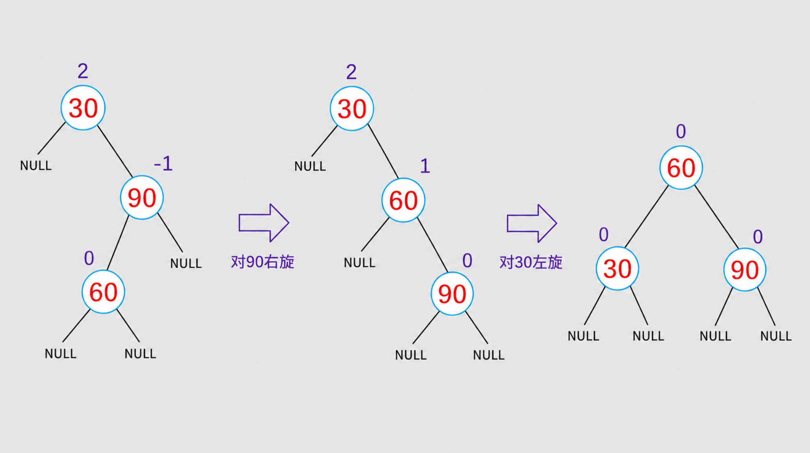
>
> ****
>
> > ```cpp
> > void RotateRL(Node* parent) // 右左双旋。
> > {
> > 	Node* subR = parent->_right;
> > 	Node* subRL = subR->_left;
> > 	int bf_subRL = subRL->_bf;
> > 	RotateR(subR);
> > 	RotateL(parent);
> > 	if (bf_subRL == -1) // 在b插入。
> > 	{
> > 		parent->_bf = 0;
> > 		subR->_bf = 1;
> > 		subRL->_bf = 0;
> > 	}
> > 	else if (bf_subRL == 1) // 在c插入。
> > 	{
> > 		parent->_bf = -1;
> > 		subR->_bf = 0;
> > 		subRL->_bf = 0;
> > 	}
> > 	else // subRL是新插入的节点。
> > 	{
> > 		parent->_bf = 0;
> > 		subR->_bf = 0;
> > 		subRL->_bf = 0;
> > 	}
> > }
> > ```


## 4.AVL树的删除


### 4.1 按照二叉搜索树的规则进行删除

```cpp
// AVL树的删除操作。
bool erase(const K& key) // 删除函数。
{
	Node* parent = nullptr;
	Node* cur = _root;
	while (cur)
	{
		if (key < (cur->_key))
		{
			parent = cur;
			cur = cur->_left;
		}
		else if (key > (cur->_key))
		{
			parent = cur;
			cur = cur->_right;
		}
		else
		{
			break;
		}
	}
	if (cur == nullptr) // 没有找到。
	{
		return false;
	}
	// &&&&&&&&&&&&&&&&&&&&&&&&&&&&&&&&&&&&&&&&&&&&&&&&&&&&&&&&&&&&&&&&&&&
	// 找到了。 cur 就是我们最后要删除的节点。
	Node* p = nullptr;  // 删除cur以后,替代cur位置的节点
	int replacement_of_cur = 0;
	// replacement_of_cur cur和parent节点的关系。
	// replacement_of_cur = 0, cur和parent节点的左节点。
	// replacement_of_cur = 1, cur和parent节点的右节点。
	if ((cur->_left != nullptr) && (cur->_right != nullptr)) // cur有左右子树。
	{
		Node* parentRightMin = cur;
		Node* rightMin = cur->_right;
		while (rightMin->_left)
		{
			parentRightMin = rightMin;
			rightMin = rightMin->_left;
		}
		cur->_key = rightMin->_key; // 替换。
		parent = parentRightMin; // 更新外部的parent变量。
		cur = rightMin;
	} // cur有左右子树 ==> 把cur换成,最多只有一个节点的位置。
	if (cur->_left != nullptr) // cur只有左子树。
	{
		p = cur->_left;
	}
	else // cur只有右子树。或者 cur是叶子。
	{
		p = cur->_right;
		// cur只有右子树,使用cur的右边代替cur的位置。
		// cur是叶子节点,也使用cur的右边代替cur的位置,左右都是NULL,效果是一样的。
	}
	if (parent == nullptr) // cur是根节点
	{
		//this->_root = nullptr; // 只需要把_root置为空,后面释放cur即可。
		this->_root = p;
		if (p)
		{
			p->_parent = nullptr;
		}
	}
	else
	{
		if (cur == (parent->_left)) // cur是parent的左孩子。
		{
			parent->_left = p;
			replacement_of_cur = 0; // 删除掉的是parent的左孩子
		}
		else // cur是parent的右孩子。
		{
			parent->_right = p;
			replacement_of_cur = 1; // 删除掉的是parent的右孩子。
		}
		if (p != nullptr) // 如果replacement不为空,更新它的父亲指针。
		{
			p->_parent = parent; // 更新 replacement 的父指针
		}
		// 删除完成。
		// ==================================================================================
		// ============================== 向上更新平衡因子 =====================================
        // 更新平衡因子,可能还有旋转处理。
	}
	delete cur; // 释放。
	cur = nullptr; // 置空。
	--(this->_size);
	return true;
}
```


****

### 4.2 更新平衡因子

>```cpp
>// ============================================================================
>// AVL树的删除
>// ============================================================================
>// 1. 按照二叉搜索树的规则进行删除。
>// 2. 更新平衡因子。
>// 3. 更新过程中出现了平衡因子为2或者-2的情况,则根据情况判断那种旋转,进行旋转处理。
>
>
>// ============================================================================
>// 平衡因子更新规律总结
>// ============================================================================
>// 第一条:
>// 右边插入,父亲平衡因子++;左边插入,父亲平衡因子--
>// 右边删除,父亲平衡因子--;左边删除,父亲平衡因子++
>
>// 第二条:
>// 插入后,父亲的平衡因子变成0,说明父亲所在的树高度没有变,对上层没有影响,更新结束。
>// 删除后,父亲的平衡因子变成0,说明父亲所在的树高度变矮了(把高的那一边删除掉了),对上层有影响,继续往上更新。
>
>// 第三条:
>// 插入后,父亲的平衡因子变成1或者-1,说明父亲所在的树高度变高了,对上层有影响,继续往上更新。
>// 删除后,父亲的平衡因子变成1或者-1,说明父亲所在的树高度没有变,对上层没有影响,更新结束。
>
>// 第四条:
>// 插入/删除后,父亲的平衡因子变成2或者-2,说明父亲所在的树出现了不平衡,需要旋转处理。
>```
>
>****
>
>删除和插入不同，需要记住以下规律：
>
>
>
>**删除节点后更新平衡因子的规律：**
>
>| 删除的位置             | 平衡因子变化    |
>| ---------------------- | --------------- |
>| 删除的是左子树中的节点 | `parent->_bf++` |
>| 删除的是右子树中的节点 | `parent->_bf--` |
>
>**判断是否继续向上更新：**
>
>| 更新后的 `parent->_bf` | 含义             | 接下来怎么做       |
>| ---------------------- | ---------------- | ------------------ |
>| `1` 或 `-1`            | 树的高度没有变化 | 停止更新           |
>| `0`                    | 树的高度变矮了   | 继续向上更新       |
>| `2` 或 `-2`            | 当前子树失衡     | 停止向上，旋转处理 |
>
>****
>
>```cpp
>	// 删除完成。
>	// ==================================================================================
>	// ============================== 向上更新平衡因子 =====================================
>	int Isfirst = 1;
>	while (parent != nullptr)
>	{
>		if (Isfirst)
>		{
>			if (replacement_of_cur == 0) // cur是parent的左子树。
>			{
>				parent->_bf++; // 左子树删除的,bf++
>			}
>			else
>			{
>				parent->_bf--;
>			}
>			Isfirst = 0;
>		}
>		else
>		{
>			if (p == parent->_left)
>			{
>				parent->_bf++; // 左子树删除的,bf++
>			}
>			else
>			{
>				parent->_bf--;
>			}
>		}
>		if ((parent->_bf == 1) || (parent->_bf == -1))
>		{
>			break; // 高度没有变化。
>		}
>		else if (parent->_bf == 0) // 高度变矮了,继续向上更新。
>		{
>			p = parent;
>			parent = parent->_parent;
>		}
>        else // parent->_bf = 2或者-2
>        {
>            // 需要旋转处理。
>        }
>	}
>```


### 4.3 有违反规则的,则进行旋转处理


> **下面为了方便我们理解，我们就使用具体的案例以及代码的情况，来具体分析每一种情况。**


#### 4.3.1 删除之后右子树高：parent->_bf == 2

> ```cpp
> Node* subR = parent->_right; // 需要根据右子树的平衡因子来判断
> ```


##### 情况1：`parent->_bf==2`&&`subR->_bf==1` 

> **解决方法：`parent位置`左单旋，并且继续更新。**
>
> 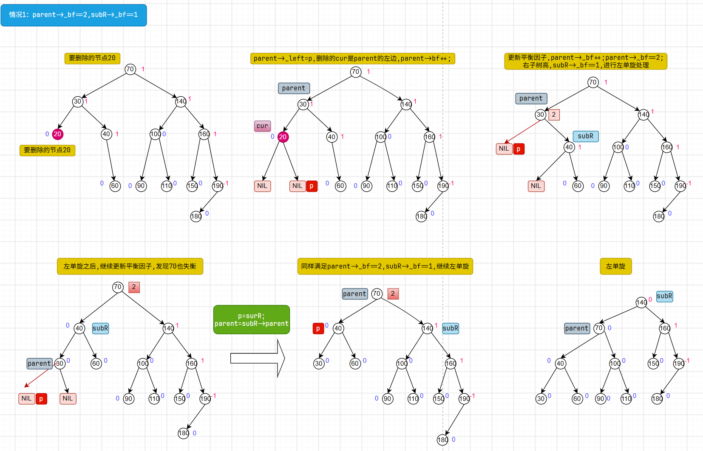
>
> ```cpp
> if (parent->_bf == 2)
> {
>     Node *subR = parent->_right;
>     if (subR->_bf == 1) // 左单旋处理。
>     {
>         // 对parent的位置进行左单旋转。
>         RotateL(parent);
>         // 树的高度减小,需要继续向上更新。
>         p = subR;
>         parent = subR->_parent;
>     }
>     else if (subR->_bf == 0)
>     {
>         // ...
>     }
>     else // subR->_bf == -1。
>     {
>         // ...
>     }
> }
> ```


##### 情况2 `parent->_bf==2` && `subR->_bf==0`

> **解决方法：`parent位置`左单旋，停止更新。**
>
> 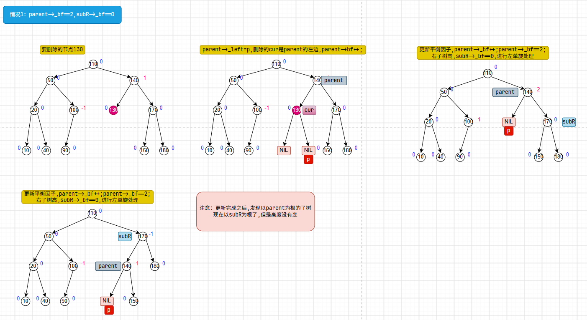
>
> ``````cpp
> if (parent->_bf == 2)
> {
>     Node *subR = parent->_right;
>     if (subR->_bf == 1) // 左单旋处理。
>     {
>         // 对parent的位置进行左单旋转。
>         RotateL(parent);
>         // 树的高度减小,需要继续向上更新。
>         p = subR;
>         parent = subR->_parent;
>     }
>     else if (subR->_bf == 0)
>     {
>         RotateL(parent);
>         parent->_bf = 1;
>         subR->_bf = -1;
>         break; // 树的高度没有变。
>     }
>     else // subR->_bf == -1。
>     {
>         // ...
>     }
> }
> ``````
>
> 


##### 情况3：`parent->_bf==2` && `subR->_bf==-1`

> **a：情况，删除之后，subRL->_bf==0**
>
> **==>特殊情况：a，b，c，d都是空树。**
>
> 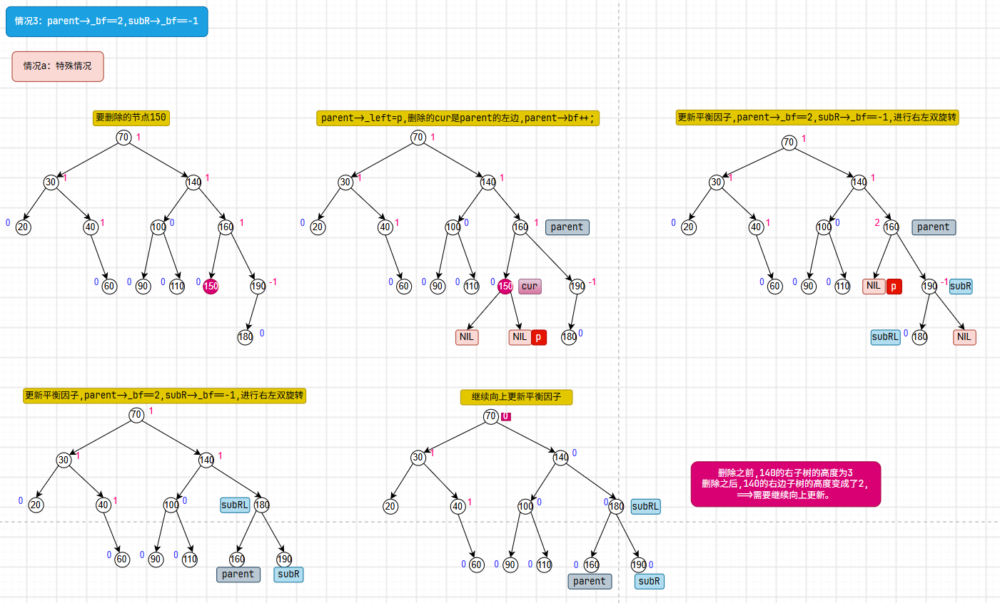
>
> **类别上面的：**
>
> 
>
> 
>
> ****
>
> **b：情况，删除之后，subRL->_bf==-1**
>
> 
>
> 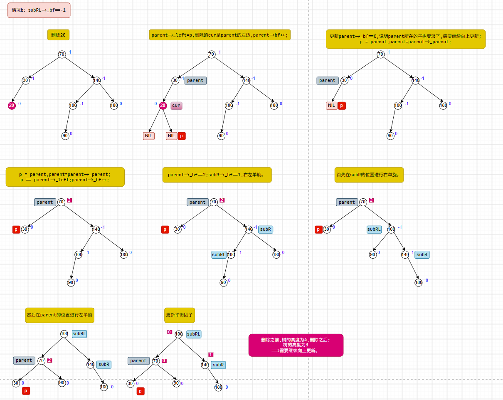
>
> 
>
> *****
>
> **c：情况，删除之后，subRL->_bf==1**
>
> 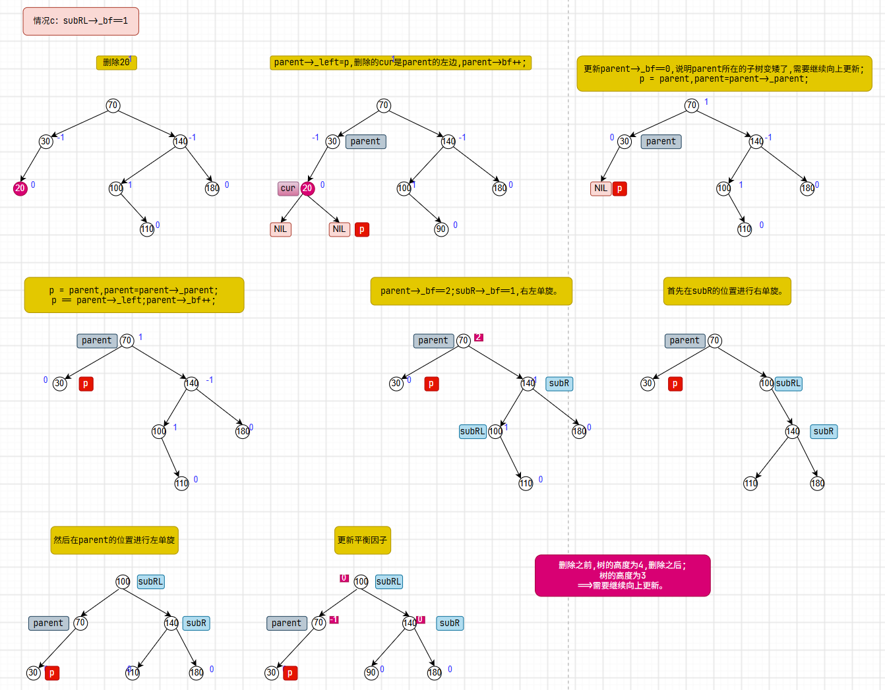
>
> 
>
> ****
>
> **总结：**
>
> * 上面的三种情况都是需要右左双旋来处理的。
> * 都是需要继续向上面更新。
> * 都是用下面一套代码分支3就把他们都有囊括了。
>
> > ``````cpp
> > if (parent->_bf == 2)
> > {
> >     Node *subR = parent->_right;
> >     if (subR->_bf == 1) // 左单旋处理。
> >     {
> >         // 对parent的位置进行左单旋转。
> >         RotateL(parent);
> >         // 树的高度减小,需要继续向上更新。
> >         p = subR;
> >         parent = subR->_parent;
> >     }
> >     else if (subR->_bf == 0)
> >     {
> >         RotateL(parent);
> >         parent->_bf = 1;
> >         subR->_bf = -1;
> >         break; // 树的高度没有变。
> >     }
> >     else // subR->_bf == -1。
> >     {
> >         Node *subRL = subR->_left;
> >         RotateRL(parent);
> >         p = subRL;
> >         parent = subRL->_parent;
> >     }
> > }
> > ``````
> >
> > 
>
> 


#### 4.3.2 删除之后左子树高：parent->_bf == -2

> ``````cpp
> Node* subL = parent->_left; // 需要根据左子树的平衡因子来判断
> ``````


##### 情况4：`parent->_bf==-2`&&`subL->_bf==-1` 


> **解决方法：`parent位置`右单旋，并且继续更新。**
>
> 
>
> 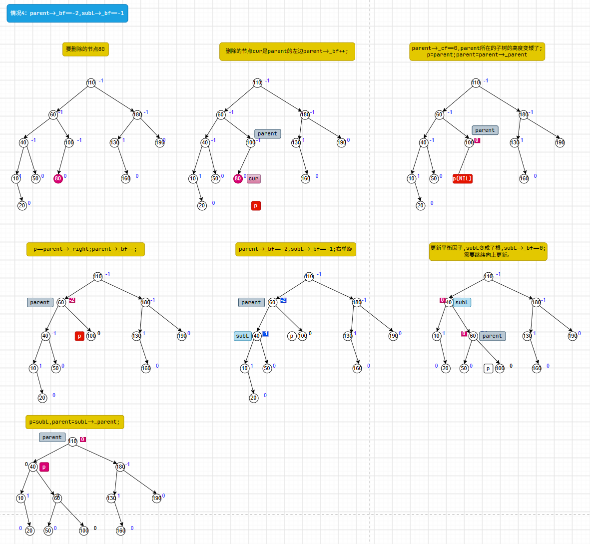
>
> > ``````cpp
> > else // parent->_bf == -2
> > {
> >     Node *subL = parent->_left;
> >     if (subL->_bf == -1)
> >     {
> >         RotateR(parent);
> >         p = subL;
> >         parent = subL->_parent;
> >     }
> >     else if (subL->_bf == 0)
> >     {
> >        // ...
> >     }
> >     else
> >     {
> >         // ...
> >     }
> > }
> > ``````


##### 情况5： `parent->_bf==-2` && `subL->_bf==0`


> **解决方法：`parent位置`右单旋，停止更新。**
>
> 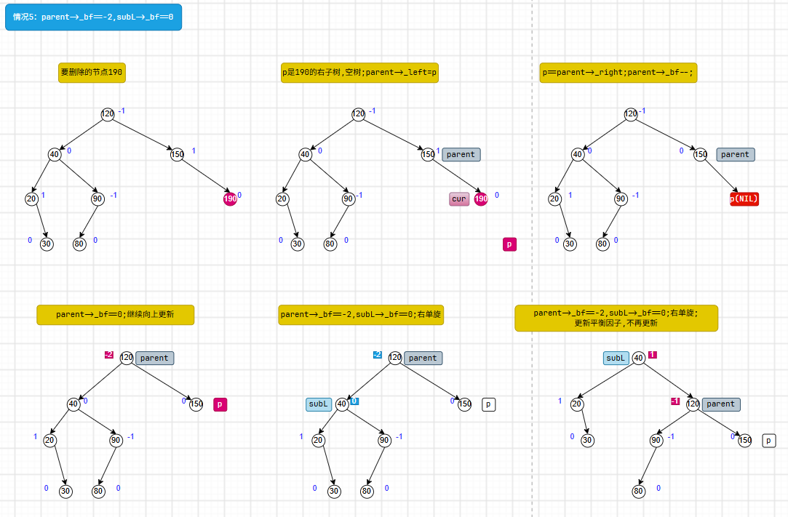
>
> > ``````cpp
> > else // parent->_bf == -2
> > {
> >     Node *subL = parent->_left;
> >     if (subL->_bf == -1)
> >     {
> >         RotateR(parent);
> >         p = subL;
> >         parent = subL->_parent;
> >     }
> >     else if (subL->_bf == 0)
> >     {
> >         RotateR(parent);
> >         parent->_bf = -1;
> >         subL->_bf = 1;
> >         break;
> >     }
> >     else
> >     {
> >         // ...
> >     }
> > }
> > ``````


##### 情况6： `parent->_bf==-2` && `subL->_bf==1`

> 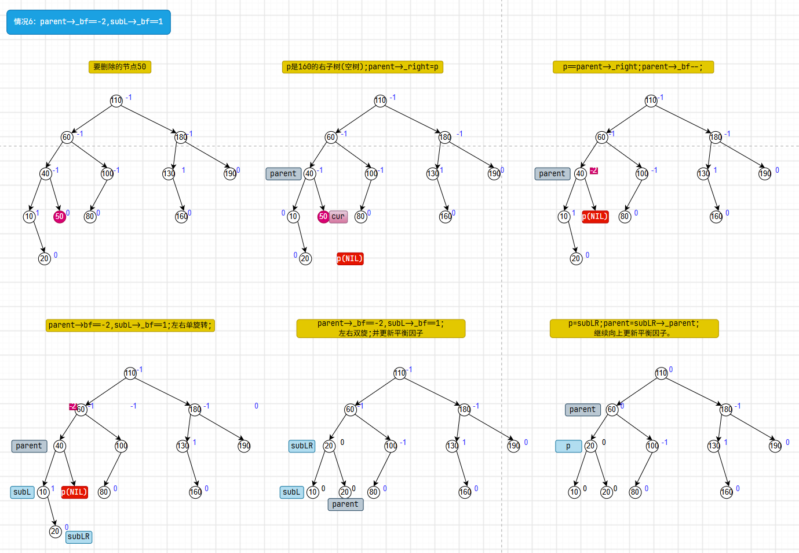
>
> ****
>
> **注意：**
>
> * 这里可以根据subLR的平衡因子继续划分出来3中情况
> * 但是处理方法任然是一样的，左右双旋
> * 我这里给出的是特殊的情况，读者有兴趣可以自行去分析。
>
> > ``````cpp
> > else // parent->_bf == -2
> > {
> >     Node *subL = parent->_left;
> >     if (subL->_bf == -1)
> >     {
> >         RotateR(parent);
> >         p = subL;
> >         parent = subL->_parent;
> >     }
> >     else if (subL->_bf == 0)
> >     {
> >         RotateR(parent);
> >         parent->_bf = -1;
> >         subL->_bf = 1;
> >         break;
> >     }
> >     else
> >     {
> >         Node *subLR = subL->_right;
> >         RotateLR(parent);
> >         p = subLR;
> >         parent = subLR->_parent;
> >     }
> > }
> > ``````


## 5. AVL树的查询

``````cpp
// AVL树的查找操作。
bool find(const K& key)
{
	Node* cur = _root;
	while (cur)
	{
		if (key < cur->_key)
		{
			cur = cur->_left;
		}
		else if (key > cur->_key)
		{
			cur = cur->_right;
		}
		else
		{
			return true; // 找到了。
		}
	}
	return false; // 没有找到。
}
``````


## 6. AVL树的验证

``````cpp
template <class K>
class KAVLTree
{
public:
	typedef KAVLTreeNode<K> Node;
	KAVLTree() : _root(nullptr), _size(0) {} // 构造函数。
	
	int height() // 树的高度
	{
		return _Height(_root);
	}

	bool isBalance() // 判断是否是平衡二叉树。
	{
		return IsBalance(_root);
	}

private:
	Node* _root = nullptr; // 根节点。

	int _Height(Node* root) // 计算树的高度的子函数
	{
		if (root == nullptr)
		{
			return 0;
		}
		int leftHeight = _Height(root->_left);
		int rightHeight = _Height(root->_right);
		return max(leftHeight, rightHeight) + 1;
	}

	bool IsBalance(Node* root) // 判断是否是平衡二叉树的子函数
	{
		if (root == nullptr)
		{
			return true;
		}
		int leftHeight = _Height(root->_left);
		int rightHeight = _Height(root->_right);
		if (abs(leftHeight - rightHeight) > 1)
		{
			return false;
		}
		return IsBalance(root->_left) && IsBalance(root->_right);
	}
};
``````


## 7. AVL树的测试。

> > ```cpp
> > #include "AVLTree.h" // AVL树的实现。
> > #include <vector>
> > #include <cstdlib> // srand, rand
> > #include <ctime> // time
> > #include <algorithm>
> > using std::vector;
> > using std::time;
> > using std::srand;
> > using std::rand;
> > using std::clock;
> > using std::sort;
> > 
> > void testKAVLTree(const int n, bool isOrdered = false)
> > {
> > 	vector <int> v;
> > 	v.reserve(n);
> > 	srand((unsigned int)time(nullptr));
> > 	for (int i = 0; i < n; ++i)
> > 	{
> > 		v.push_back(rand());
> > 	}
> > 	if (isOrdered)
> > 	{
> > 		sort(v.begin(), v.end());
> > 	}
> > 	// 随机数据的准备。
> > 	// ===========================================================
> > 	KAVLTree<int> myset;
> > 
> > 	// ===============================================================
> > 	// AVL树的插入操作的测试。
> > 	size_t start = clock();
> > 	for (auto& e : v)
> > 	{
> > 		myset.insert(e);
> > 	}
> > 	size_t end = clock();
> > 	cout << "AVL树插入时间: " << (end - start) << " ms" << endl;
> > 	cout << "AVL树的高度: " << myset.height() << endl;
> > 	cout << "AVL树是否平衡: " << (myset.isBalance() ? "是" : "否") << endl;
> > 	cout << "AVL树的大小: " << myset.size() << endl;
> > 	// ================================================================
> > 	// AVL树的查找操作的测试。
> > 	start = clock();
> > 	for (auto& e : v)
> > 	{
> > 		if (!myset.find(e))
> > 		{
> > 			cout << "AVL树中没有找到: " << e << endl;
> > 		}
> > 	}
> > 	end = clock();
> > 	cout << "AVL树查找时间: " << (end - start) << " ms" << endl;
> > 	// ===============================================================
> > 	// AVL树的删除操作的测试。
> > 	start = clock();
> > 	for (auto& e : v)
> > 	{
> > 		myset.erase(e);
> > 		if (!myset.isBalance())
> > 		{
> > 			cout << "AVL树不平衡!" << endl;
> > 			break;
> > 		}
> > 		//cout << myset.size() << " ";
> > 	}
> > 	end = clock();
> > 	cout << "AVL树删除时间: " << (end - start) << " ms" << endl;
> > 	// ===============================================================
> > }
> > 
> > void testKVAVLTree(const int n, bool isOrdered = false)
> > {
> > 	vector <int> v;
> > 	v.reserve(n);
> > 	srand((unsigned int)time(nullptr));
> > 	for (int i = 0; i < n; ++i)
> > 	{
> > 		v.push_back(rand());
> > 	}
> > 	if (isOrdered)
> > 	{
> > 		sort(v.begin(), v.end());
> > 	}
> > 	// 随机数据的准备。
> > 	// ===========================================================
> > 	KVAVLTree<int, int> dict;
> > 	// ===============================================================
> > 	// AVL树的插入操作的测试。
> > 	size_t start = clock();
> > 	for (auto& e : v)
> > 	{
> > 		dict.insert(make_pair(e, e));
> > 	}
> > 	size_t end = clock();
> > 	cout << "AVL树插入时间: " << (end - start) << " ms" << endl;
> > 	cout << "AVL树的高度: " << dict.height() << endl;
> > 	cout << "AVL树是否平衡: " << (dict.isBalance() ? "是" : "否") << endl;
> > 	cout << "AVL树的大小: " << dict.size() << endl;
> > 	// ================================================================
> > 	// AVL树的查找操作的测试。
> > 	start = clock();
> > 	for (auto& e : v)
> > 	{
> > 		if (!dict.find(e))
> > 		{
> > 			cout << "AVL树中没有找到: " << e << endl;
> > 		}
> > 	}
> > 	end = clock();
> > 	cout << "AVL树查找时间: " << (end - start) << " ms" << endl;
> > 	// ===============================================================
> > 	// AVL树的删除操作的测试。
> > 	start = clock();
> > 	for (auto& e : v)
> > 	{
> > 		dict.erase(e);
> > 		if (!dict.isBalance())
> > 		{
> > 			cout << "AVL树不平衡!" << endl;
> > 			break;
> > 		}
> > 	}
> > 	end = clock();
> > 	cout << "AVL树删除时间: " << (end - start) << " ms" << endl;
> > }
> > 
> > int main()
> > {
> > 	const int n = 10000;
> > 	testKAVLTree(n, false);
> > 	// K模型的AVL树。
> > 	cout << "========================================================" << endl;
> > 	//testKVAVLTree(n, false);
> > 	return 0;
> > }
> > ```
>
> 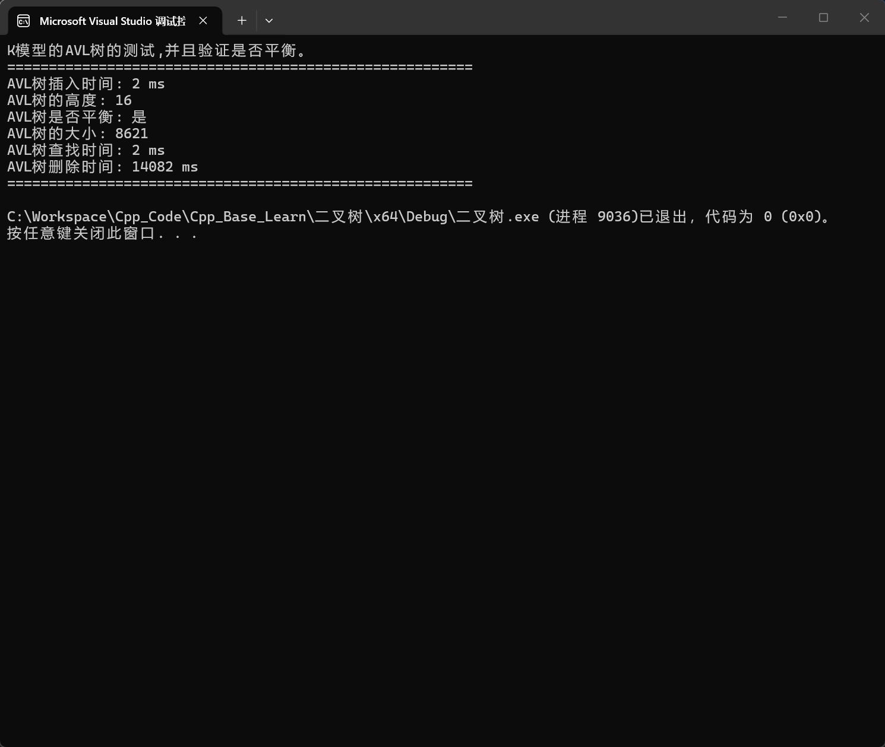
>
> 


``````
@ 笔记完成于2026年9月4日。 @jszcmd
``````


