# 红黑树


## 1. 红黑树的概念


> **红黑树：**
>
> * 是一种二叉搜索树
> * 但在每个结点上增加一个存储位表示结点的颜色，可以是Red或Black。
> * 通过对任何一条从根到叶子的路径上各个结点着色方式的限制，红黑树确保没有一条路径会比其他路径长出俩倍，因而是接近平衡的。
>
> ****
>
> 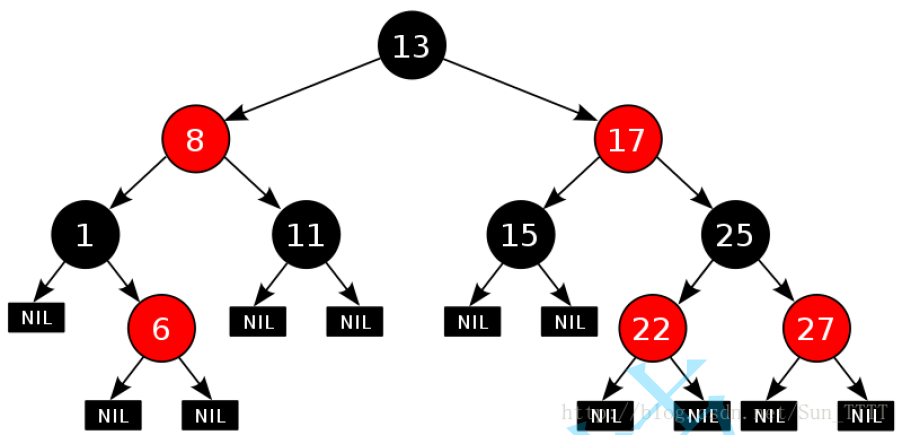
>
> ****
>
> 红黑树：
>
> 1. 搜索二叉树，
> 2. 节点中加了颜色，不是红色就是黑色，树中的最长路径不超过最短路径的2倍。
>
> ****
>
> * AVL树是严格的二叉搜索树。
> * 红黑树是一种近似平衡的二叉搜索树。


****


## 2. 红黑树的性质


> **红黑树的性质**：
>
> 1. 每个结点不是红色就是黑色
> 2. 根节点是黑色的
> 3. 如果一个节点是红色的，则它的两个孩子结点是黑色的
> 4. 对于每个结点，从该结点到其所有后代叶结点的简单路径上，均包含相同数目的黑色结点
> 5. 每个叶子结点都是黑色的（此处的叶子结点指的是空结点）
>
> 思考：为什么满足上面的性质，红黑树就能保证：其最长路径中节点个数不会超过最短路径节点个数的两倍？
>
> ****
>
> **总结一下红黑树的性质**：
>
> 1. 根是黑的。
> 2. 没有连续的红节点
> 3. 每条路径都有相同数量黑节点。
>
> ****
>
> **最短的路径**：全黑。
>
> **最长的路径**：一黑一红。
>
> 所以最多是2倍。
>
> ****
>
> **红黑树的增删查改的时间复杂度都是`O(log n)`**
>
> 1. 最短路径上操作是：`O(log n)`
> 2. 最长的路径是：`2 * O(log n)`
> 3. 也就是说理论上而言，红黑是的效率比AVL树略差。`但是对于现在的硬件而言，两者效率是一样的`
> 4.  但是插入同样的节点红黑树比AVL树旋转的更加少，因为AVLTree更严格的平衡其实是通过多旋转达到的。
> 5.  并且其实红黑树的实现上更加容易。
> 6. 所以实际上红黑树得到了更加广泛的应用。


## 3. 红黑树节点的定义

> ```cpp
> enum Color
> {
> 	RED, // 红色
> 	BLACK // 黑色
> };
> 
> template <class K, class V>
> class RBTreeNode
> {
> public:
> 	RBTreeNode<K, V>* _left;
> 	RBTreeNode<K, V>* _right;
> 	RBTreeNode<K, V>* _parent;
> 	Color _color; // 颜色
> 	pair<K, V> _kv; // 数据域。
> 
> 	// 构造函数。
> 	RBTreeNode(const pair<K, V>& kv, Color color = RED)
> 		: _left(nullptr)
> 		, _right(nullptr)
> 		, _parent(nullptr)
> 		, _color(color) // 默认颜色为红色。
> 		, _kv(kv) {}
> };
> ```


## 4.红黑树的插入操作


### 4.1. 按照二叉搜索的树规则插入新节点

> ```cpp
> bool insert(const pair<K, V>& kv) // 插入函数。
> {
> 	// 1. 先按照二叉搜索树的规则插入节点。
> 	if (_root == nullptr)
> 	{
> 		_root = new Node(kv, BLACK); // 根节点必须为黑色。
> 		return true;
> 	}
> 	Node* parent = nullptr;
> 	Node* cur = _root;
> 	while (cur)
> 	{
> 		if (kv.first < cur->_kv.first) // 左边找
> 		{
> 			parent = cur; 
> 			cur = cur->_left;
> 		}
> 		else if (kv.first > cur->_kv.first) // 右边找
> 		{
> 			parent = cur;
> 			cur = cur->_right;
> 		}
> 		else
> 		{
> 			return false; // 不允许插入重复的键。
> 		}
> 	}
> 	cur = new Node(kv, RED); // 新插入的节点给红色的好。
> 	cur->_parent = parent;
> 	if ((parent->_kv.first) < (cur->_kv.first))
> 	{
> 		parent->_right = cur;
> 	}
> 	else
> 	{
> 		parent->_left = cur;
> 	}
> 	// 插入成功。
> 	// -----------------------------------------------------
>     // 检测新节点插入后，红黑树的性质是否造到破坏
> 	_root->_color = BLACK; // 根节点必须为黑色。
> 	return true;
> }
> ```


### 4.2 检测新节点插入后，红黑树的性质是否造到破坏

>* 我们这里采用的是新节点的默认颜色是红色
>* 如果其双亲节点的颜色是黑色，没有违反红黑树任何性质，则不需要调整
>* 但当新插入节点的双亲节点颜色为红色时，就违反了性质三不能有连在一起的红色节点
>
>****
>
>**一共有这些情况：**
>
>| 大类        | 叔叔情况        | cur 的位置 | 操作                     | 是否继续向上 |
>| ----------- | --------------- | ---------- | ------------------------ | ------------ |
>| parent 在左 | 叔叔为红        | 任意       | 父、叔变黑，爷爷变红     | 继续         |
>| parent 在左 | 叔叔为黑/不存在 | cur 在右   | 左单旋 + swap            | 转为单旋场景 |
>| parent 在左 | 叔叔为黑/不存在 | cur 在左   | 右单旋，父变黑，爷爷变红 | 停止         |
>| parent 在右 | 叔叔为红        | 任意       | 父、叔变黑，爷爷变红     | 继续         |
>| parent 在右 | 叔叔为黑/不存在 | cur 在左   | 右单旋 + swap            | 转为单旋场景 |
>| parent 在右 | 叔叔为黑/不存在 | cur 在右   | 左单旋，父变黑，爷爷变红 | 停止         |
>
>****
>
>**下面我们具体分析parent是左子树的情况：**
>
>
>
>> **情况1：cur为红,p为红,g为黑,u存在且为红色的**
>>
>> 
>>
>> **抽象图：**
>>
>> 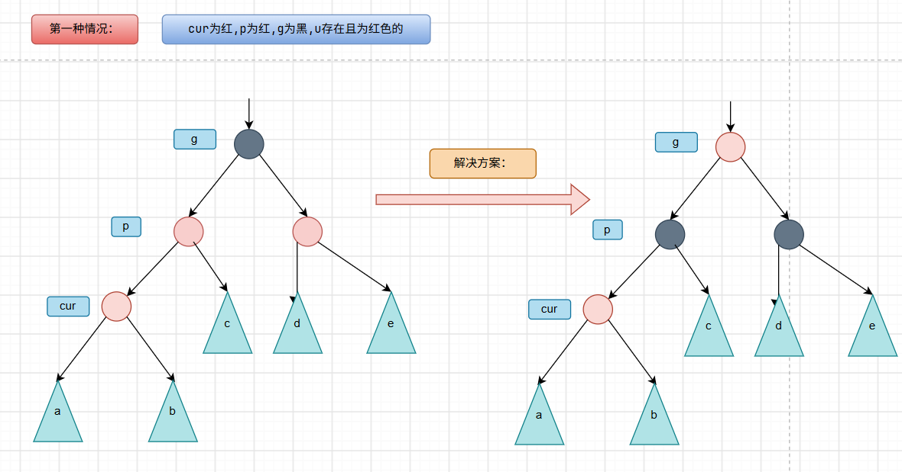
>>
>> 
>>
>> **具体实例：**
>>
>> 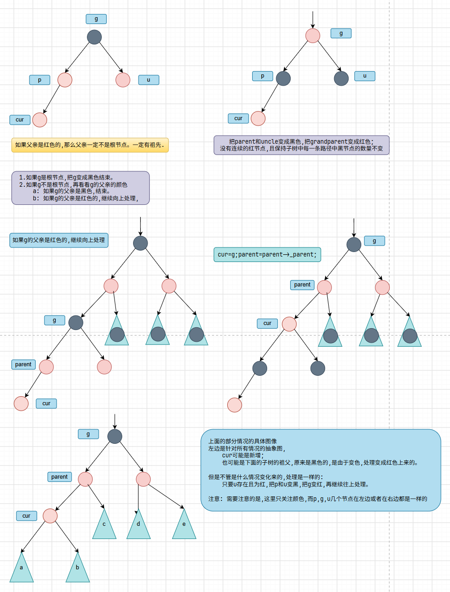
>>
>> 
>>
>> ****
>>
>> **情况2：cur为红,p为红,g为黑,u不存在或者为黑。`cur是p的左孩子。`**
>>
>> 
>>
>> **抽象图：**
>>
>> 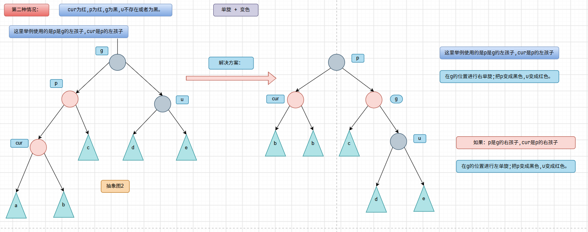
>>
>> 
>>
>> **如果u不存在,那么cur就是新增加的节点**
>>
>> 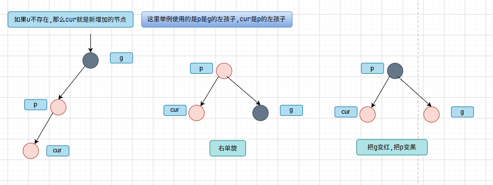
>>
>> 
>>
>> **如果u存在且为黑,那么cur一定不是新增加的节点**
>>
>> 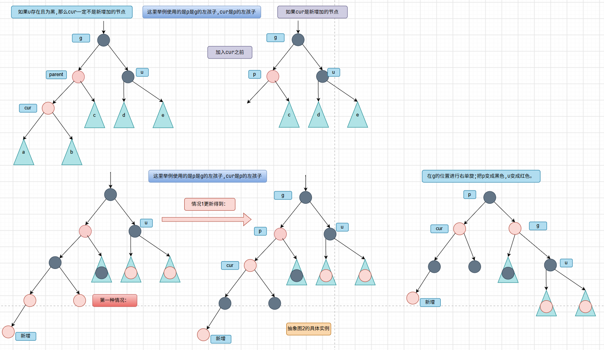
>>
>> 
>>
>> ****
>>
>> **情况3：cur为红,p为黑,g为黑,u不存在或者为黑。`cur是p的右孩子`**
>>
>> 
>>
>> **u不存在：**
>>
>> 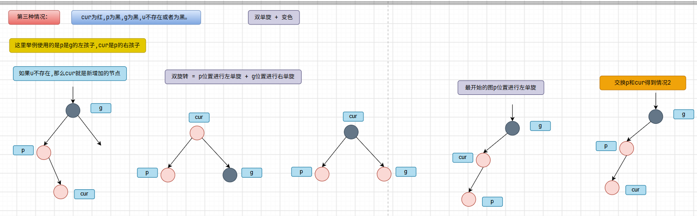
>>
>> 
>>
>> **u存在且为黑：**
>>
>> 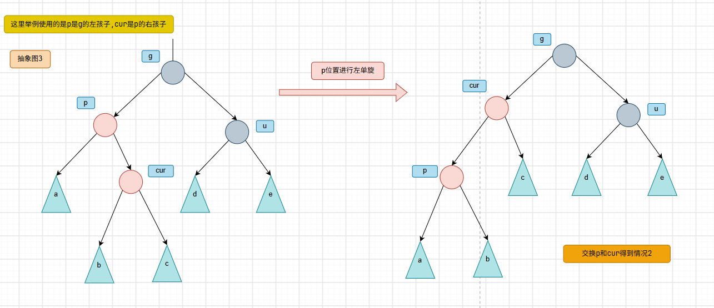
>
>
>
>
>
>```cpp
>while (parent && (parent->_color == RED))
>{
>	// 红黑树的条件关键看叔叔。
>	Node* grandparent = parent->_parent; // 爷爷节点。
>	// 找到叔叔节点。
>	Node* uncle = nullptr;
>	if (parent == grandparent->_left) 
>	{
>		uncle = grandparent->_right; // 叔叔是爷爷的右孩子。
>		// 情况1: 叔叔存在,且为红色。
>		if (uncle && uncle->_color == RED) 
>		{
>			parent->_color = uncle->_color = BLACK; // 父亲和叔叔变黑。
>			grandparent->_color = RED; // 爷爷变红。
>			// 继续往上处理。
>			cur = grandparent; 
>			parent = cur->_parent; 
>		}
>		else // 叔叔不存在或者为黑色。
>		{
>			// 情况3: 双旋 --> 变成单旋。
>			if (cur == parent->_right)
>			{
>				RotateL(parent); // parent的位置左单旋。
>				swap(cur, parent); // 交换cur和parent。
>			}
>			// 情况2: 单旋。(也有可能是第3种情况变过来的)
>			RotateR(grandparent);
>			grandparent->_color = RED;
>			parent->_color = BLACK;
>			break; 
>		}
>	}
>	else // parent == grandparent->_right
>	{
>		uncle = grandparent->_left; // 叔叔是爷爷的左孩子。
>		if (uncle && uncle->_color == RED) // 情况1: 叔叔存在,且为红色。
>		{
>			parent->_color = uncle->_color = BLACK; // 父亲和叔叔变黑。
>			grandparent->_color = RED; // 爷爷变红。
>			// 继续往上处理。
>			cur = grandparent;
>			parent = cur->_parent;
>		}
>		else // 叔叔不存在或者为黑色。
>		{
>			// 情况3: 双旋 --> 变成单旋。
>			if (cur == parent->_left)
>			{
>				RotateR(parent); // parent的位置右单旋。
>				swap(cur, parent); // 交换cur和parent。
>			}
>			// 情况2: 单旋。(也有可能是第3种情况变过来的)
>			RotateL(grandparent);
>			grandparent->_color = RED;
>			parent->_color = BLACK;
>			break;
>		}
>	}
>}
>```
>
>


## 5. 红黑树的删除


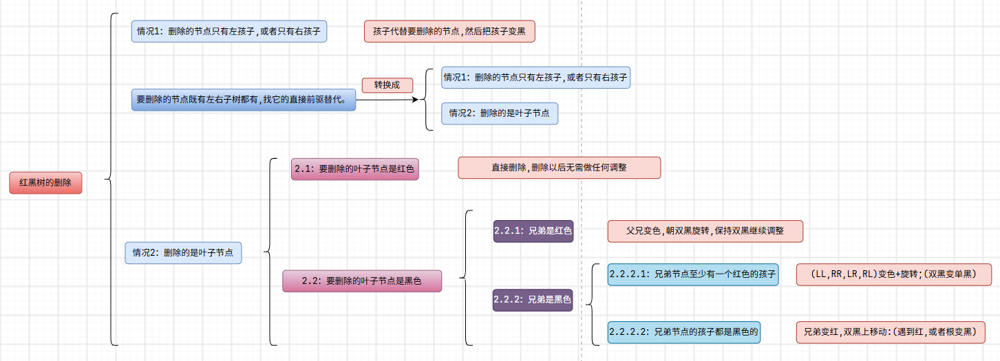


### 情况1：删除的节点只有左孩子,或者只有右孩子


> 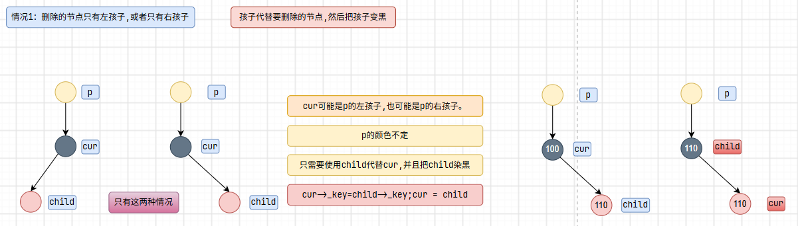
>
> > ```cpp
> > if ((cur->isOnlyLeft()) || (cur->isOnlyRight())) // 要删除的节点有一个子节点。
> > {
> > 	Node* child = (cur->_left != nullptr) ? cur->_left : cur->_right;
> > 	cur->_key = child->_key;
> > 	cur->_color = BLACK; // 保险起见。
> > 	cur->_left = cur->_right = nullptr;
> > 	cur = child; // 删除cur。
> > }
> > ```


### 情况2：删除的是叶子节点


#### 2.1：要删除的叶子节点是红色

> 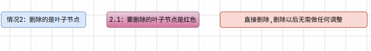
>
> 
>
> >```cpp
> >if (isRedNode(cur)) // 情况2：删除的是叶子节点 2.1：要删除的叶子节点是红色
> >{
> >	; // 直接删除,删除以后无需做任何调整
> >}
> >```


#### 2.2：要删除的叶子节点是黑色

>
>
>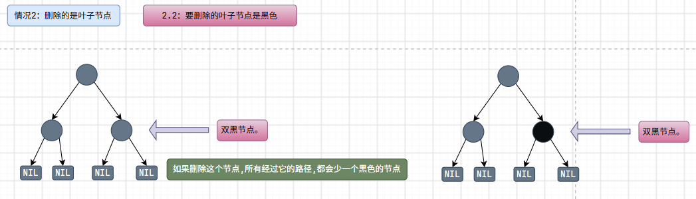


##### 2.2.1：兄弟是红色

> 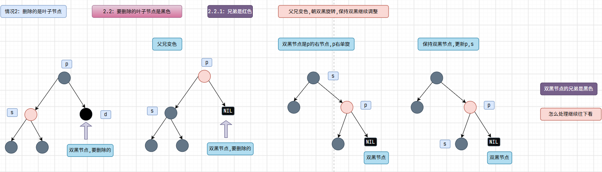
>
> >
> >
> >```cpp
> >if (isRedNode(sibling)) // 2.2.1：兄弟是红色
> >{
> >	// 父兄变色,朝双黑旋转,保持双黑继续调整
> >	parent->_color = RED;
> >	sibling->_color = BLACK;
> >	// 朝双黑旋转
> >	if (doubleBlack == parent->_left)
> >	{
> >		RotateL(parent);
> >	}
> >	else
> >	{
> >		RotateR(parent);
> >	}
> >	// 保持双黑继续调整
> >	parent = doubleBlack->_parent;
> >	sibling = (doubleBlack == parent->_left) ? (parent->_right) : (parent->_left);
> >}
> >```


##### 2.2.2：兄弟是黑色


###### 2.2.2.1：兄弟节点至少有一个红色的孩子

>*****
>
>**情况1：LL型：**
>
>> 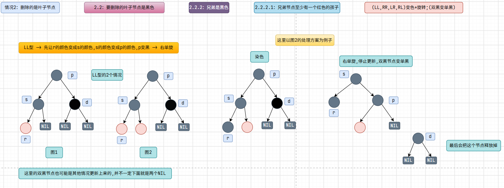
>
>
>
>*****
>
>
>
>**情况2：RR型：**
>
>> 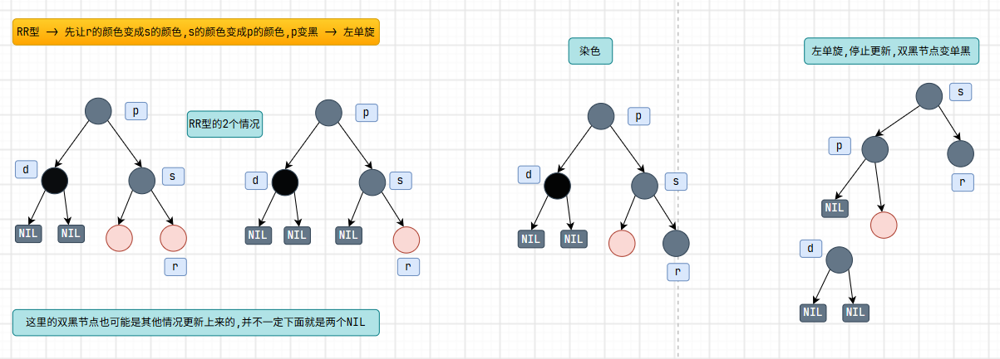
>
>*****
>
>
>
>**情况3：LR型：**
>
>> 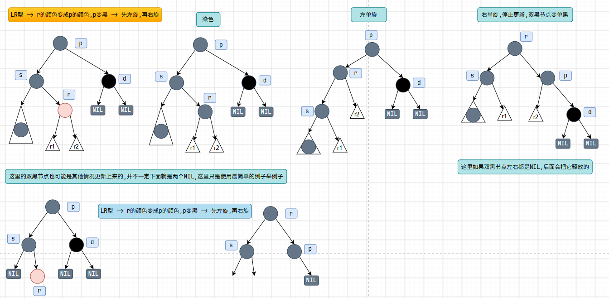
>
>
>
>*****
>
>**情况4：RL型：**
>
>> 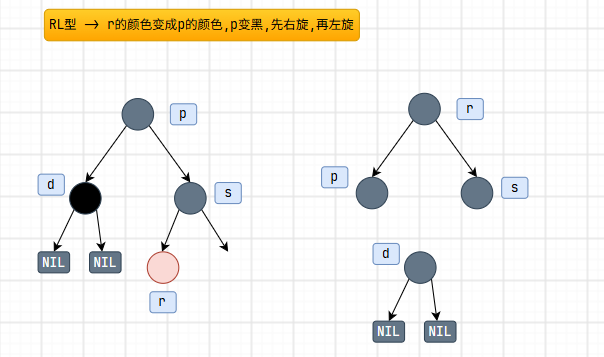
>
>


###### 2.2.2.2：兄弟节点的孩子都是黑色的

>
>
>**特殊情况1：双黑节点遇到根节点**
>
>> 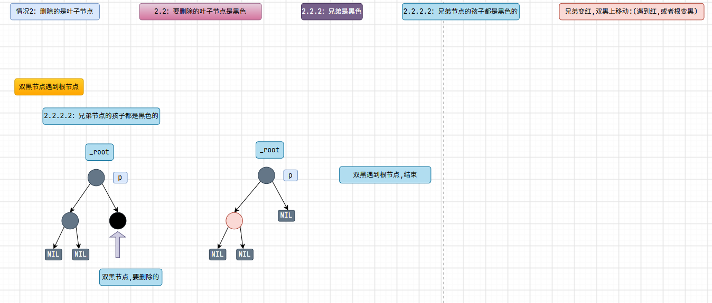
>
>
>
>******
>
>**特殊情况2： 双黑节点遇到红节点**
>
>> 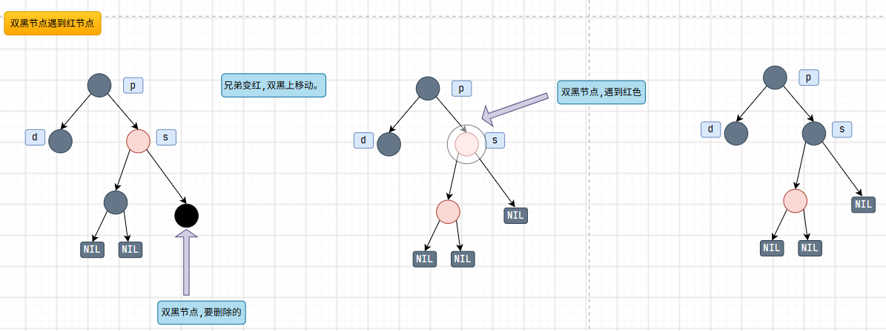
>
>
>
>*****
>
>> 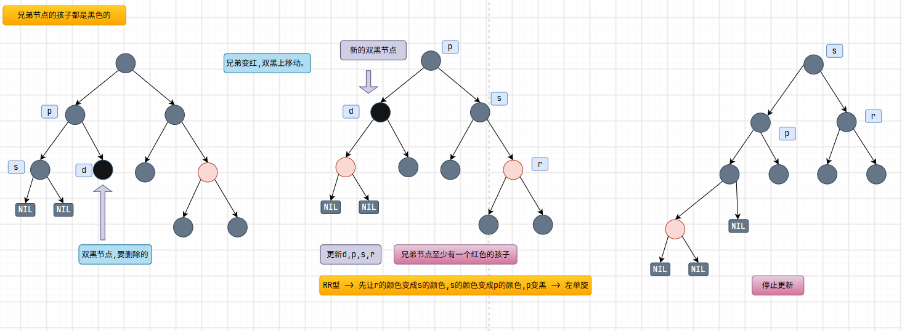
>
>
>
>*****
>
>```cpp
>// 2.2.2.2：兄弟节点的孩子都是黑色的
>if ((isBlackNode(sibling->_left)) && (isBlackNode(sibling->_right)))
>{
>				sibling->_color = RED; // 兄弟变红。
>				if (parent == _root) // 父节点是根节点
>				{
>					break; // 直接把双黑节点变成单黑节点
>				}
>				else if (parent->_color == RED) // 父节点是红色
>				{
>					parent->_color = BLACK; // 父节点变黑。
>					break;
>				}
>				else
>				{
>					doubleBlack = doubleBlack->_parent; // 双黑节点上移。
>					parent = doubleBlack->_parent; // 更新父节点。
>					sibling = (doubleBlack == parent->_left) ? (parent->_right) : (parent->_left); // 更新兄弟节点。
>				}
>}
>```


## 6. 红黑树的验证

> 红黑树的检测分为两步：
> 1. 检测其是否满足二叉搜索树(中序遍历是否为有序序列)
> 2. 检测其是否满足红黑树的性质
>
> > ```cpp
> > // key模型的红黑树。
> > template <class K>
> > class KRBTree
> > {
> > public:
> > 	typedef KRBTreeNode<K> Node;
> > 	KRBTree() : _root(nullptr), _size(0) {} // 构造函数。
> > 
> > 	// 验证红黑树的性质。
> > 	bool isValidRBTree()
> > 	{
> > 		Node* pRoot = _root;
> > 		// 空树也是红黑树
> > 		if (nullptr == pRoot)
> > 			return true;
> > 
> > 		// 检测根节点是否满足情况
> > 		if (BLACK != pRoot->_color)
> > 		{
> > 			cout << "违反红黑树性质二：根节点必须为黑色" << endl;
> > 			return false;
> > 		}
> > 
> > 		// 获取任意一条路径中黑色节点的个数
> > 		size_t blackCount = 0;
> > 		Node* pCur = pRoot;
> > 		while (pCur)
> > 		{
> > 			if (BLACK == pCur->_color)
> > 				blackCount++;
> > 			pCur = pCur->_left;
> > 		}
> > 
> > 		// 检测是否满足红黑树的性质，k用来记录路径中黑色节点的个数
> > 		size_t k = 0;
> > 		return _IsValidRBTree(pRoot, k, blackCount);
> > 	}
> > 
> > private:
> > 	Node* _root; // 根节点。
> > 	int _size; // 树的大小。
> > 
> > 	// 验证红黑树的性质的子函数。
> > 	bool _IsValidRBTree(Node* pRoot, size_t k, const size_t blackCount)
> > 	{
> > 		// 走到null之后，判断k和black是否相等
> > 		if (nullptr == pRoot)
> > 		{
> > 			if (k != blackCount)
> > 			{
> > 				cout << "违反性质四：每条路径中黑色节点的个数必须相同" << endl;
> > 				return false;
> > 			}
> > 			return true;
> > 		}
> > 
> > 		// 统计黑色节点的个数
> > 		if (BLACK == pRoot->_color)
> > 			k++;
> > 
> > 		// 检测当前节点与其双亲是否都为红色
> > 		Node* pParent = pRoot->_parent;
> > 		if (pParent && RED == pParent->_color && RED == pRoot->_color)
> > 		{
> > 			cout << "违反性质三：没有连在一起的红色节点" << endl;
> > 			return false;
> > 		}
> > 
> > 		return _IsValidRBTree(pRoot->_left, k, blackCount) && _IsValidRBTree(pRoot->_right, k, blackCount);
> > 	}
> > 
> > };
> > ```


## 7. 红黑树与AVL树的比较

> * 红黑树和AVL树都是高效的平衡二叉树，增删改查的时间复杂度都是`O(log n)`
> * 红黑树不追求绝对平衡，其只需保证最长路径不超过最短路径的2倍，
> * 相对而言，降低了插入和旋转的次数，所以在经常进行增删的结构中性能比AVL树更优，
> * 而且红黑树实现比较简单，所以实际运用中红黑树更多。
>
> *****
>
> **代码测试：**
>
> > ```cpp
> > // 红黑树的代码测试和性能分析。
> > 
> > #include "AVLTree.h" // AVL树的实现。
> > #include "RBTree.h" // 红黑树的实现。
> > #include <vector>
> > #include <cstdlib> // srand, rand
> > #include <ctime> // time
> > #include <algorithm>
> > using std::vector;
> > using std::time;
> > using std::srand;
> > using std::rand;
> > using std::clock;
> > using std::sort;
> > 
> > // 红黑树的测试函数。
> > void testKRBTree(const int n, vector<int> v, bool isTestBalance = false)
> > {
> > 	// ===========================================================
> > 	KRBTree<int> retree;
> > 	// ===============================================================
> > 	cout << "--------------------------------------------------------------" << endl;
> > 	// 红黑树的插入操作的测试。
> > 	size_t start = clock();
> > 	for (auto& e : v)
> > 	{
> > 		retree.insert(e);
> > 	}
> > 	size_t end = clock();
> > 	cout << "红黑树插入时间: " << (end - start) << " ms" << endl;
> > 	cout << "红黑树的高度: " << retree.height() << endl;
> > 	cout << "红黑树是否平衡: " << (retree.isValidRBTree() ? "是" : "否") << endl;
> > 	cout << "红黑树的大小: " << retree.size() << endl;
> > 	// ================================================================
> > 	cout << "--------------------------------------------------------------" << endl;
> > 	// 红黑树的查找操作的测试。
> > 	start = clock();
> > 	for (auto& e : v)
> > 	{
> > 		if (!retree.find(e))
> > 		{
> > 			cout << "红黑树中没有找到: " << e << endl;
> > 		}
> > 	}
> > 	end = clock();
> > 	cout << "红黑树查找时间: " << (end - start) << " ms" << endl;
> > 	// ===============================================================
> > 	cout << "--------------------------------------------------------------" << endl;
> > 	// 红黑树的删除操作的测试。
> > 	start = clock();
> > 	for (auto& e : v)
> > 	{
> > 		retree.erase(e);
> > 		if (isTestBalance && !retree.isValidRBTree())
> > 		{
> > 			cout << "红黑树不平衡!" << endl;
> > 			break;
> > 		}
> > 	}
> > 	end = clock();
> > 	cout << "红黑树删除时间: " << (end - start) << " ms" << endl;
> > }
> > 
> > // AVL树的测试函数。
> > void testKAVLTree(const int n, vector<int> v, bool isTestBalance = false)
> > {
> > 	// ===========================================================
> > 	KAVLTree<int> avltree;
> > 	// ===============================================================
> > 	cout << "--------------------------------------------------------------" << endl;
> > 	// AVL树的插入操作的测试。
> > 	size_t start = clock();
> > 	for (auto& e : v)
> > 	{
> > 		avltree.insert(e);
> > 	}
> > 	size_t end = clock();
> > 	cout << "AVL树插入时间: " << (end - start) << " ms" << endl;
> > 	cout << "AVL树的高度: " << avltree.height() << endl;
> > 	cout << "AVL树是否平衡: " << (avltree.isBalance() ? "是" : "否") << endl;
> > 	cout << "AVL树的大小: " << avltree.size() << endl;
> > 	// ================================================================
> > 	cout << "--------------------------------------------------------------" << endl;
> > 	// AVL树的查找操作的测试。
> > 	start = clock();
> > 	for (auto& e : v)
> > 	{
> > 		if (!avltree.find(e))
> > 		{
> > 			cout << "AVL树中没有找到: " << e << endl;
> > 		}
> > 	}
> > 	end = clock();
> > 	cout << "AVL树查找时间: " << (end - start) << " ms" << endl;
> > 	// ===============================================================
> > 	cout << "--------------------------------------------------------------" << endl;
> > 	// AVL树的删除操作的测试。
> > 	start = clock();
> > 	for (auto& e : v)
> > 	{
> > 		avltree.erase(e);
> > 		if (isTestBalance && !avltree.isBalance())
> > 		{
> > 			cout << "AVL树不平衡!" << endl;
> > 			break;
> > 		}
> > 	}
> > 	end = clock();
> > 	cout << "AVL树删除时间: " << (end - start) << " ms" << endl;
> > 	// ===============================================================
> > }
> > 
> > 
> > int main()
> > {
> > 	const int n = 10000000; // 测试数据的个数。
> > 	vector<int> v;
> > 	v.reserve(n);
> > 	srand((unsigned int)time(nullptr));
> > 	for (int i = 0; i < n; ++i)
> > 	{
> > 		v.push_back(rand());
> > 	}
> > 	// 随机数据的准备。
> > 	// ===========================================================
> > 	testKRBTree(n, v, false); // 红黑树的测试。
> > 	cout << "===========================================================================================" << endl;
> > 	testKAVLTree(n, v, false); // AVL树的测试。
> > 	return 0;
> > }
> > ```
>
> 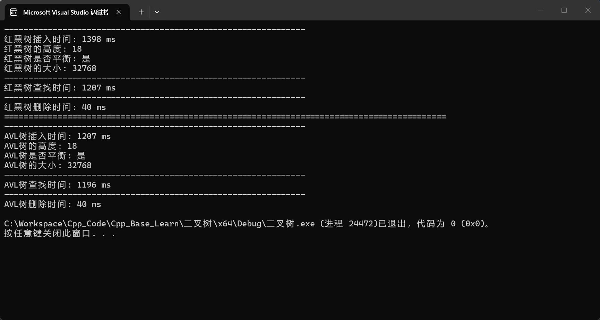
>
> 


> 笔记：完成于2026年9月1日。